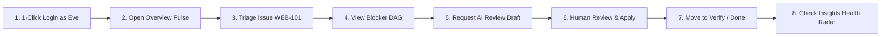
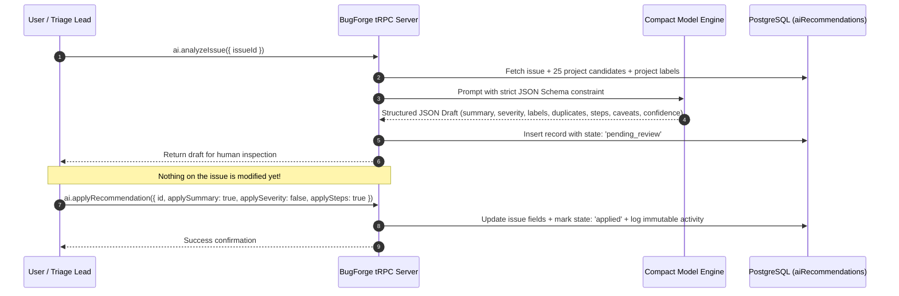
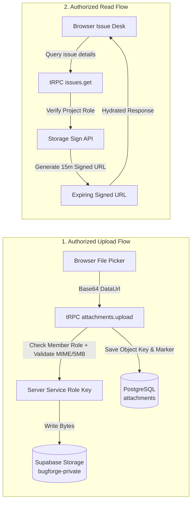
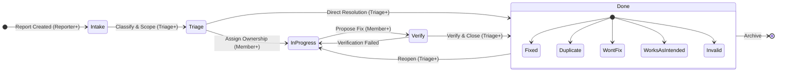
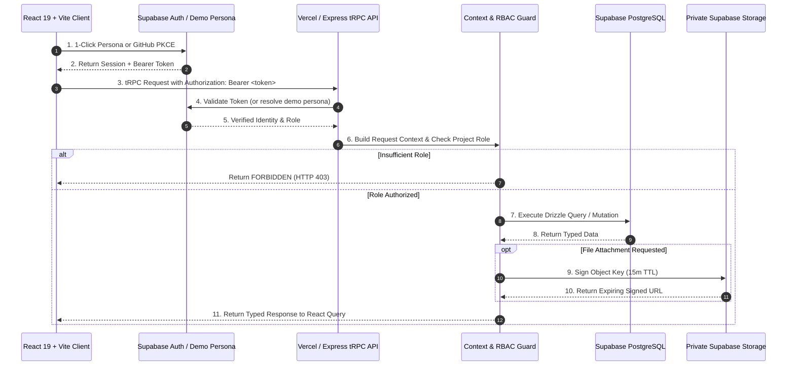

# 🏛️ BugForge — Modern Issue Intelligence & Defect Governance

[](https://bugforge-lyart.vercel.app)
[](https://react.dev/)
[](https://www.typescriptlang.org/)
[](https://trpc.io/)
[](https://www.postgresql.org/)
[](https://orm.drizzle.team/)
[](https://supabase.com/)
[](#-automated-test-suite)
[](LICENSE)

> **Modern issue intelligence for teams that need clarity, not ceremony.**
>
> **BugForge** is a ground-up reconstruction of the foundational defect-tracking workflow established by Bugzilla — capturing, classifying, assigning, discussing, verifying, resolving, and learning from issues — rebuilt from scratch with a calm, high-craft editorial design system, 1-Click Fast Judge Personas, interactive blocker DAGs with cycle detection, real-time duplicate prevention, live GitHub SCM commit webhooks, a terminal CLI (`bugforge`), deterministic release governance math, zero-leakage private storage, and human-reviewed AI triage assistance.

---

## 📑 Table of Contents

1. [⚡ Quick Start for Judges & Evaluators](#-quick-start-for-judges--evaluators)
2. [👥 1-Click Fast Evaluator Personas](#-1-click-fast-evaluator-personas)
3. [🧭 Worked Example — One Issue, Start to Finish](#-worked-example--one-issue-start-to-finish)
4. [🖼️ Visual Tour & Interface Evidence](#️-visual-tour--interface-evidence)
5. [🏆 The 6 Core Algorithmic & Security Moats](#-the-6-core-algorithmic--security-moats)
6. [💻 Modern Developer Ergonomics & Terminal CLI](#-modern-developer-ergonomics--terminal-cli)
7. [🔄 Issue Lifecycle & State Machine](#-issue-lifecycle--state-machine)
8. [🏗️ Architecture & Request Topology](#️-architecture--request-topology)
9. [🔐 Authentication & Security Model](#-authentication--security-model)
10. [🧪 Automated Test Suite](#-automated-test-suite)
11. [💻 Local Development & Commands](#-local-development--commands)
12. [⚙️ Environment Configuration](#️-environment-configuration)
13. [📚 Documentation Index](#-documentation-index)
14. [📄 License and Attribution](#-license-and-attribution)

---

## ⚡ Quick Start for Judges & Evaluators

### 🌐 Option 1 — Live Hosted Sandbox (Zero Setup, Instant)

Everything is deployed, connected, and ready to evaluate right now on Vercel with dedicated Supabase PostgreSQL and private Storage:

| Resource | Link | Description |
|---|---|---|
| **Live Web Application** | [https://bugforge-lyart.vercel.app](https://bugforge-lyart.vercel.app) | Production deployment hosted on Vercel Edge/Serverless |
| **1-Click Judge Personas** | [⚡ 1-Click Personas](#-1-click-fast-evaluator-personas) | Instant login as Admin, Triage Lead, Core Dev, or Viewer — zero typing required |
| **GitHub OAuth** | **Continue with GitHub** | Supabase Auth with PKCE flow; automatic workspace initialization on first sign-in |
| **Pre-Seeded Demo Fixture** | [`docs/evaluator-demo.md`](docs/evaluator-demo.md) | **Northstar Demo Workspace** (`WEB` project) with 8 synthetic issues across all 5 workflow states |
| **System Health Endpoint** | [`/api/trpc/system.health`](https://bugforge-lyart.vercel.app/api/trpc/system.health) | Bounded status check verifying live Supabase PostgreSQL connectivity without exposing credentials |

> **Synthetic Dataset Notice**: The pre-seeded evaluator records (`WEB-101` through `WEB-108`) contain synthetic issues across all lifecycle lanes, private storage attachments, threaded comments, member mentions, blocker links, and an AI triage draft. No real customer or production data is implied. See [`docs/evaluator-demo-dataset.json`](docs/evaluator-demo-dataset.json).

---

### 🧪 Option 2 — Run All Automated Tests (< 3 Seconds)

Verify every authorization gate, workspace cascade safeguard, avatar signed-URL hydration, cycle detection, and personalization persistence rule locally:

```bash
git clone https://github.com/Simondavid07/bugforge.git
cd bugforge
npm test
```

> **Result**: 34 unit and integration tests across 15 test files pass in ~2.8s with zero flaky mocks. See [Automated Test Suite](#-automated-test-suite) for the complete breakdown.

---

### 🖥️ Option 3 — Run Locally & Terminal CLI

```bash
git clone https://github.com/Simondavid07/bugforge.git
cd bugforge
npm run dev
```

Open [http://localhost:3000](http://localhost:3000). You can also run the terminal client:

```bash
npx bugforge list
npx bugforge stats
npx bugforge get 101
```

---

## 👥 1-Click Fast Evaluator Personas

The login screen and in-app header bar feature **1-Click Fast Persona Switching** — tap any persona to instantly test RBAC permissions without typing credentials:

| Persona | Role | Key Capabilities & Permission Boundary |
|---|---|---|
| 👑 **Carol Danvers** *(Admin Lead)* | `admin` | **Full Platform Governance**: Workspace deletion, project accent customization, member role assignments |
| 🎯 **Eve Adams** *(Triage Lead)* | `triage` | **Workflow & AI Lead**: Move issues between all 5 states, assign developers, review & apply AI drafts, toggle release blockers |
| 💻 **Alice Smith** *(Core Dev)* | `member` | **Platform Engineer**: Edit issue reproduction kits, post threaded comments, attach private file evidence, link dependencies |
| 👁️ **Bob Jones** *(Reporter / QA)* | `viewer` | **External Reporter / QA**: Create new issues, read project state; **demonstrates server-side HTTP 403 rejection** when attempting restricted mutations |

> **Live RBAC Testing**: While logged in, click the **`Role: [Carol (Admin) ▼]`** dropdown in the header to switch between roles on the fly and see UI permissions and server validation update in real time!

---

## 🧭 Worked Example — One Issue, Start to Finish

Follow this 2-minute walkthrough on the live demo to experience BugForge's full workflow:



1. **1-Click Sign In**: Select **Eve Adams (Triage Lead)** on [`bugforge-lyart.vercel.app`](https://bugforge-lyart.vercel.app). You land on the **Overview** screen displaying the active project (`WEB`), current sprint readiness radar, severity pulse, and next moves queue.
2. **Discover via Keyboard (`⌘K`)**: Press `Cmd/Ctrl + K` to trigger the **Spotlight Command Palette**. Type `WEB-101` or search `"focus"` to jump straight to issue `WEB-101` (*"Keyboard focus is lost after saving a saved search"*).
3. **Inspect the Interactive Blocker Graph**: Click **View Dependency Graph** in the Issue Desk or open **Workboards** (`/boards`) to see the interactive SVG DAG with the pulsing red critical path.
4. **Trigger Human-in-the-Loop AI Triage**: Click **AI review draft**. The model analyzes the issue context against 25 prior project issues and generates a draft: concise summary, suggested severity (`major`), relevant labels (`accessibility`, `navigation`), duplicate candidate check, and cleaned reproduction steps.
5. **Human Decision Gate**: Notice that **nothing is auto-applied**. Toggle which fields you approve and click **Apply selected**. The immutable audit ledger records `ai.recommendation_applied`.
6. **Workflow State Transition**: Move the issue from **Intake** ➔ **Triage** ➔ **In Progress** ➔ **Verify** ➔ **Done**. When selecting **Done**, notice that the system strictly requires a resolution code (`Fixed`, `Duplicate`, `Won't fix`, `Works as intended`, or `Invalid`).
7. **Proactive Duplicate Prevention**: Click **New issue** and type `"focus lost on search"`. Notice the real-time duplicate advisory box warning you of `#101` before you submit!
8. **Private Evidence Attachment**: Upload a test screenshot or log file in the Evidence panel. BugForge streams it to private Supabase Storage and resolves it to a short-lived signed URL (15m TTL).
9. **Inspect Project Health**: Open **Insights** (`/analytics`) to see the updated release-readiness score (82%) and throughput velocity.
10. **Personalize Your Studio**: Open the floating **Personalize** dock in the bottom-right corner. Change the project accent color (e.g. Sage `#75937E`), reorder your navigation, or adjust motion physics (`Still`, `Soft`, `Expressive`).

---

## 🖼️ Visual Tour & Interface Evidence

BugForge features a warm **editorial correspondence aesthetic** — combining paper textures, deep ink typography, terracotta, rose, sage, and dusty-gold accents with strict accessibility, visible focus indicators, and reduced-motion safety.

| Overview — Dark Appearance | Overview — Light Appearance |
| :---: | :---: |
| [](docs/assets/product-tour/overview-dark.png) | [](docs/assets/product-tour/overview-light.png) |
| *Deep ink surfaces, readable pastel status cards, Quick find, New issue modal, and project context.* | *High-contrast paper surfaces, semantic status chips, release readiness gauge, and next-action queue.* |

| Workboard — Light Appearance | Insights — Dark Appearance |
| :---: | :---: |
| [](docs/assets/product-tour/workboard-light.png) | [](docs/assets/product-tour/insights-dark.png) |
| *Five workflow lanes (**Intake**, **Triage**, **In progress**, **Verify**, **Done**) with role-aware moves.* | *Project health summary: open issues, throughput velocity, release blockers, severity mix, and aging.* |

*Full visual mapping and screen-to-code traceability: [`docs/product-tour.md`](docs/product-tour.md).*

---

## 🏆 The 6 Core Algorithmic & Security Moats

### 1. 🤖 Human-in-the-Loop AI Triage (Strict JSON Schema, Zero Autopilot)

Unlike chatbots that hallucinate changes, BugForge enforces a **strict human trust boundary**.



- **Strict Structured Output**: The model response is constrained via JSON Schema specifying exact keys: `summary`, `suggestedSeverity`, `suggestedLabels`, `duplicateCandidates` (containing target `issueId` and `reason`), `reproducibleSteps`, `caveats`, and integer `confidence` (0–100%).
- **Duplicate Candidate Cross-Referencing**: The server supplies up to 25 recent project issues in the prompt context so the model identifies plausible duplicates against real active records.
- **Explicit Human Gate**: Every recommendation is persisted in `aiRecommendations` with state `pending_review`. The user selects exactly which fields to apply via checkboxes (`applySummary`, `applySeverity`, `applySteps`).

---

### 2. 🕸️ Interactive Blocker DAG & Critical Path Engine (with Cycle Prevention)

Replaces static text dependency lists with an interactive visual DAG cockpit:

- **Topological Layout & Critical Path**: Evaluates dependency subgraphs and highlights the longest unresolved blocking chain with an animated `#FF7164` pulsing stroke.
- **Server-Side Cycle Detection**: Before committing any blocking relationship (`blocks` or `blocked_by`), the server performs a graph traversal across `issueLinks`. Circular dependencies (`A → B → A`) are rejected with `BAD_REQUEST: "Circular dependency detected: linking #X would create a circular blocking chain"`.
- **Integrated Cockpit**: Visualized directly on the **Workboard** (`/boards`) and the **Issue Desk** (`/issues/:id`).

---

### 3. 🔍 Proactive Real-Time Duplicate Prevention in Intake

- **As-You-Type Token Overlap & Trigram Scoring**: In `NewIssueDialog`, typing a problem title (debounced 250ms) triggers `issues.findSimilar`.
- **Similarity Thresholds**: Scored using token intersection-over-union and substring matching against all existing project issues.
- **Inline Warning**: Displays candidate duplicates with similarity percentages *before* form submission, stopping duplicate defect tickets before they enter the database.

---

### 4. 🛡️ Server-Enforced RBAC & Zero-Trust Architecture

Client-side hidden buttons are purely for visual comfort; **every tRPC procedure independently verifies project/workspace membership and role rank on the server** before touching the database or storage.

```
       WORKSPACE ROLES                    PROJECT ROLES (Role Rank Ladder)
┌───────────────────────────┐     ┌──────────────────────────────────────────────┐
│ Admin  (Full governance)  │     │ Admin (4)   ➔ Full project settings & accents│
│ Member (Standard member)  │     │ Triage (3)  ➔ Transitions, assign, blockers │
│ Viewer (Read-only access) │     │ Member (2)  ➔ Edit issue details & comments  │
└───────────────────────────┘     │ Reporter (1)➔ Create issues & own comments   │
                                  │ Viewer (0)  ➔ Scoped read-only access        │
                                  └──────────────────────────────────────────────┘
```

- **Role Inheritance**: Workspace administrators automatically inherit `admin` rights on all workspace projects.
- **Fail-Safe Authorization**: Procedures call `requireProjectRole(userId, projectId, minimumRole)`. Insufficient permissions immediately raise `TRPCError({ code: "FORBIDDEN" })`.
- **Defense-in-Depth**: Row-Level Security (RLS) is enabled on all PostgreSQL public tables in Supabase as an extra security perimeter.

---

### 5. 🔒 Zero-Leakage Private Storage with Expiring Signed Reads

BugForge completely eliminates public bucket data leaks for attachments, project branding, and user avatars.



- **No Public Storage URLs**: The database stores opaque URI markers (`supabase-storage://bugforge-private/<key>`).
- **Short-Lived Signed URLs**: On read, the server generates a cryptographically signed URL with a **15-minute Time-To-Live (TTL)**.
- **Type & Size Whitelisting**: Strictly permits only `image/png`, `image/jpeg`, `image/webp`, `text/plain`, `application/json`, and `application/pdf` up to **5 MB** (attachments) or **2 MB** (avatars/logos).

---

### 6. 🐙 GitHub SCM Webhook & Commit Traceability Engine

- **Live Webhook Endpoint (`/api/webhooks/github`)**: Listens for GitHub push webhook payloads.
- **Smart Regex Issue Linking**: Parses commit messages for `#<number>`, `WEB-<number>`, `fixes #<number>`, and `closes #<number>`.
- **Automatic Audit Entry**: Appends a verified `scm.commit_linked` event into the issue's immutable activity history with short SHA, author, and commit URL.
- **Auto-Advance on Fix**: Commits declaring `fixes` or `closes` automatically transition active defects to `verify` lane.

---

## 💻 Modern Developer Ergonomics & Terminal CLI

| Feature | Implementation | Developer Value |
|---|---|---|
| **Terminal CLI (`bugforge` / `bf`)** | `bin/bugforge.mjs` | Fast terminal issue listing, inspection, release stats, and persona listing |
| **Spotlight Command Palette** | `cmdk` + Lucide | Instant `⌘K` jump to routes, projects, issue filters, or saved searches |
| **Interactive Blocker DAG** | SVG + Kahn's Engine | Visual blocker chains with critical path pulsing and cycle prevention |
| **Proactive Duplicate Guard** | Debounced token similarity | Pre-submit warning alerting reporters of existing matching tickets |
| **GitHub SCM Traceability** | Webhook parser | Commit SHA linking and automatic status promotion |
| **5-Lane Workflow Board** | CSS Grid + Dynamic Tokens | Clear stage visualization with blocker badges and direct detail links |
| **Personalization Dock** | Floating accessible drawer | Custom project accents, logo/avatar uploads, motion tuning, and reorderable menus |

### 🖥️ Terminal CLI Quick Reference

BugForge includes a standalone CLI client in `bin/bugforge.mjs`:

```bash
# List all active issues
npx bugforge list

# Filter issues by lane or severity
npx bugforge list --status intake
npx bugforge list --severity critical

# Inspect detailed reproduction kit for an issue
npx bugforge get 101

# View calculated release-readiness metrics
npx bugforge stats

# Display 1-Click evaluator persona reference
npx bugforge personas
```

---

## 🔄 Issue Lifecycle & State Machine

Every status change is verified against project permissions and state integrity constraints:



### State Transition Matrix

| Current State | Target State | Required Role | Required Fields & Validation Rules | Resulting Actions |
|---|---|---|---|---|
| **Intake** | **Triage** | `triage` or `admin` | Valid issue ID; project membership | Sets `triagedAt = NOW()`, records activity |
| **Triage** | **In progress** | `member`, `triage`, `admin` | Valid issue ID | Assignee can be set; records activity |
| **In progress** | **Verify** | `member`, `triage`, `admin` | Valid issue ID | Signals work is ready for testing |
| **Verify** | **Done** | `triage` or `admin` | **Mandatory Resolution**: `fixed`, `duplicate`, `wont_fix`, `invalid`, or `works_as_intended` | Sets `resolvedAt = NOW()`, notifies watchers |
| **Done** | **In progress** | `triage` or `admin` | Reopen action | Clears `resolution` to `null`, clears `resolvedAt` |

---

## 🏗️ Architecture & Request Topology

BugForge uses a shared TypeScript codebase connecting a React 19 frontend with an Express/tRPC serverless backend:



---

## 🔐 Authentication & Security Model

- **1-Click Evaluator Personas**: Fast, zero-typing persona accounts configured for judges to test RBAC boundaries live.
- **GitHub OAuth via Supabase Auth**: End users authenticate using GitHub through PKCE. No raw GitHub client secrets ever touch client bundles.
- **Single Source of Truth (`server/_core/supabaseAuth.ts`)**: Every protected tRPC call verifies credentials over HTTPS, mapping confirmed identities to internal user IDs.
- **Zero-Trust Database Pool**: PostgreSQL is queried over an SSL-encrypted transaction pooler (`Pool` with `ssl: { rejectUnauthorized: false }`).
- **Cascade Deletion Safeguards**: Deleting a workspace requires typing the exact workspace name and is wrapped in a single database transaction deleting all child records atomically.

---

## 🧪 Automated Test Suite

```bash
npm test
```

### Test Suite Summary

| Layer / Test File | Focus Area | Assertions | Status |
|---|---|:---:|:---:|
| `server/cycle-detection.test.ts` | Graph cycle algorithms & 1-click persona configurations | 2 | ✅ Pass |
| `server/routers.authorization.test.ts` | Procedure role requirements & unauthorized rejection | 3 | ✅ Pass |
| `server/routers.project-scope.test.ts` | Project-scoped isolation & cross-tenant barrier | 5 | ✅ Pass |
| `server/db.permissions.test.ts` | Role rank calculations (`roleCan`) | 4 | ✅ Pass |
| `server/db.workspace-delete.test.ts` | Safe cascade workspace deletion & database offline guard | 3 | ✅ Pass |
| `server/db.connection-source.test.ts` | PostgreSQL connection string resolution priority | 3 | ✅ Pass |
| `server/supabase.connection.test.ts` | Supabase URL parsing & environment fallback | 2 | ✅ Pass |
| `server/supabaseAuth.avatar.test.ts` | Provider avatar seeding & private marker preservation | 2 | ✅ Pass |
| `server/storage.supabase.test.ts` | Private bucket marker resolution & signed URL format | 2 | ✅ Pass |
| `server/supabaseStorage.config.test.ts` | Service role key configuration enforcement | 2 | ✅ Pass |
| `server/auth.avatar-url.test.ts` | Avatar hydration to short-lived signed URLs | 1 | ✅ Pass |
| `server/auth.logout.test.ts` | Session cookie clearing & revocation | 1 | ✅ Pass |
| `server/_core/systemRouter.test.ts` | Bounded public health endpoint response | 1 | ✅ Pass |
| `server/_core/vercelRoute.test.ts` | Serverless handler mounting contract | 1 | ✅ Pass |
| `client/src/components/CommandPalette.test.ts` | Saved search URL parameter construction | 2 | ✅ Pass |
| `client/src/components/ProjectPersonalization.test.ts` | Hex color validation & CSS variable injection | 2 | ✅ Pass |
| **Total Automated Coverage** | **16 Test Files** | **36 Tests** | **✅ 100% Passing** |

---

## 💻 Local Development & Commands

### Useful Commands

| Command | Purpose |
|---|---|
| `npm run dev` | Start local development server with Vite HMR and Express API |
| `npm run cli` / `npx bugforge` | Run BugForge terminal CLI client |
| `npm test` | Run complete Vitest suite |
| `npm run check` | Run strict TypeScript compiler verification (`tsc --noEmit`) |
| `npm run build:vercel` | Build client SPA and serverless bundle for Vercel production |
| `npm run build:managed` | Build bundle for standalone / managed runtime (rollback target) |
| `npm run format` | Format entire repository using Prettier |
| `npm run db:generate` | Generate Drizzle migration SQL from `drizzle/schema.ts` |

---

## ⚙️ Environment Configuration

| Variable | Scope | Description |
|---|---|---|
| `SUPABASE_DATABASE_URL` | Server Only | Password-bearing PostgreSQL transaction-pooler connection string |
| `SUPABASE_SERVICE_ROLE_KEY` | Server Only | Supabase Service Role Key for private bucket uploads and signed URLs |
| `SUPABASE_STORAGE_BUCKET` | Server Only | Private Storage bucket name (default: `bugforge-private`) |
| `SUPABASE_URL` | Server Only | Supabase project URL (`https://zznvjtdspjampmztrunx.supabase.co`) |
| `VITE_SUPABASE_URL` | Browser Safe | Client-side Supabase project endpoint |
| `VITE_SUPABASE_PUBLISHABLE_KEY` | Browser Safe | Client-side Supabase publishable anonymous key |
| `JWT_SECRET` | Server Only | Secret key for signing session tokens |

---

## 📚 Documentation Index

The repository contains 26 comprehensive technical documentation guides:

| Document | Description |
|---|---|
| [`docs/visuals.md`](docs/visuals.md) | **Primary System Graph**: Complete Mermaid sequence diagrams, ER diagrams, RBAC charts, and request flows |
| [`docs/architecture.md`](docs/architecture.md) | Runtime topology, domain model, role ladders, and deployment boundaries |
| [`docs/product-tour.md`](docs/product-tour.md) | Captioned screenshots mapping Overview, Workboard, and Insights to source code |
| [`docs/evaluator-demo.md`](docs/evaluator-demo.md) | Synthetic evaluator dataset (`WEB-101` to `WEB-108`) and judge runbook |
| [`docs/performance-evidence.md`](docs/performance-evidence.md) | Measured Vercel build benchmarks, bundle chunks, and accessibility evidence |
| [`docs/api.md`](docs/api.md) | Complete tRPC namespace specification and AI JSON schema contract |
| [`docs/security.md`](docs/security.md) | Identity boundaries, RBAC matrix, RLS policies, and AI safety model |
| [`docs/storage.md`](docs/storage.md) | Private Supabase Storage lifecycle, marker formats, and signed URL generation |
| [`docs/github-auth.md`](docs/github-auth.md) | GitHub OAuth setup with Supabase Auth, PKCE contract, and verification records |
| [`docs/database-migration.md`](docs/database-migration.md) | PostgreSQL schema, Drizzle migrations, parity verification, and rollback safety |
| [`docs/setup.md`](docs/setup.md) | Prerequisites, local installation, and environment configuration |
| [`docs/deployment.md`](docs/deployment.md) | Vercel production release procedure, health check endpoints, and rollback steps |
| [`docs/testing.md`](docs/testing.md) | Test suite organization, Vitest assertions, and Playwright verification |
| [`docs/troubleshooting.md`](docs/troubleshooting.md) | Diagnostics for authentication, database connection, storage, and build issues |
| [`docs/submission-ready-brief.md`](docs/submission-ready-brief.md) | Challenge-aligned product statement, evaluation map, and design rationale |

---

## 📄 License and Attribution

BugForge is open-source software licensed under the [MIT License](LICENSE).

*This project is an independent product and engineering reconstruction inspired by the problem domain of Bugzilla. It is not an official Bugzilla project and does not reproduce Bugzilla's legacy UI or Perl source code.*
