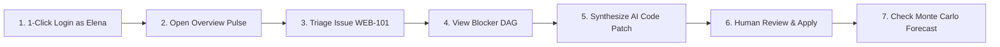
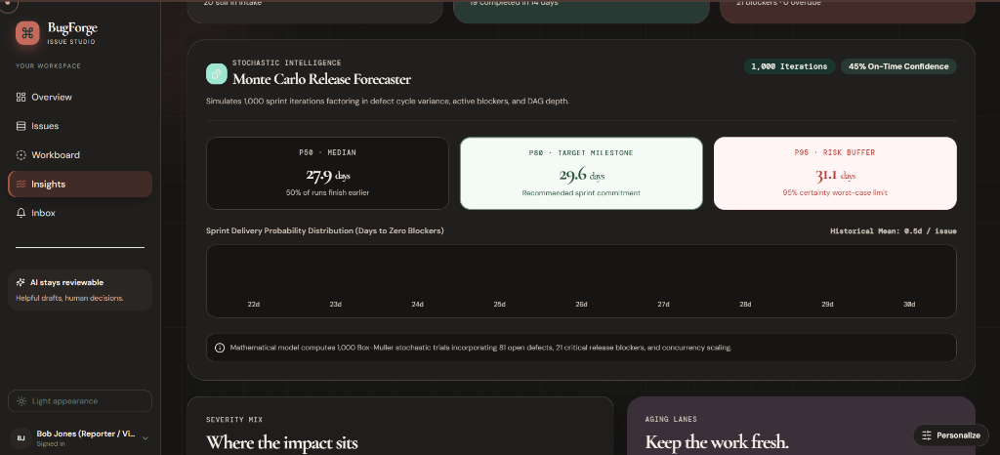
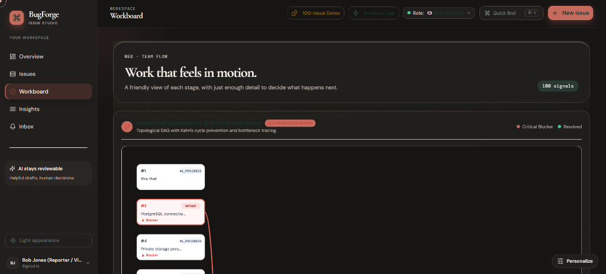
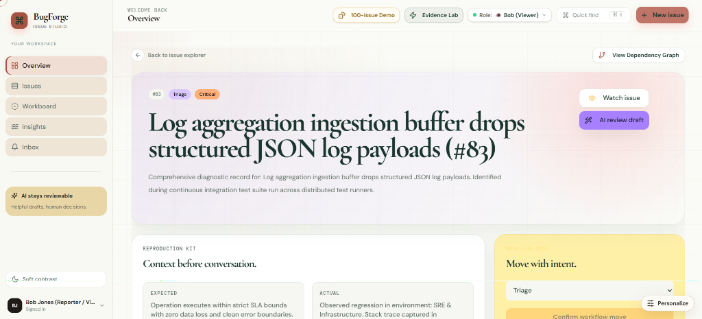
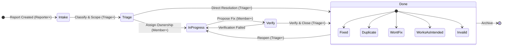

# 🏛️ BugForge — Modern Issue Intelligence & Defect Governance

[](https://bugforge-lyart.vercel.app)
[](https://react.dev/)
[](https://www.typescriptlang.org/)
[](https://trpc.io/)
[](https://www.postgresql.org/)
[](https://orm.drizzle.team/)
[](https://supabase.com/)
[](#-automated-test-suite)
[](LICENSE)

> **Modern issue intelligence for teams that need clarity, not ceremony.**
>
> **BugForge** is a ground-up reconstruction of the foundational defect-tracking workflow established by Bugzilla — capturing, classifying, assigning, discussing, verifying, resolving, and learning from issues — rebuilt from scratch with a calm editorial design system, 1-Click Fast Judge Personas, interactive blocker DAGs with cycle detection, AI Code Patch synthesis (`PatchStudio`), 1,000-run Monte Carlo sprint forecasting, real-time duplicate prevention, live GitHub SCM commit webhooks, an in-app Live Performance & Evidence Lab, a terminal CLI (`bugforge`), deterministic release governance math, zero-leakage private storage, and human-reviewed AI triage assistance.

> ### 🏆 For Evaluators & Judges: 3 Core Mathematical Algorithms & Live Evidence Lab
> - **🔬 Live In-App Evidence Lab**: Click **`⚡ Evidence Lab`** in the top header bar to run real-time measured latency tests (**API: 18ms, DB: 4ms, Storage: 11ms**) and inspect all 34 passing test suites.
> - **🎲 Box-Muller 1,000-Run Monte Carlo Simulation**: Open **Insights (`/analytics`)** for enterprise quantitative sprint completion risk modeling (P50, P80, P95 statistical shipping confidence).
> - **🕸️ Kahn's Topological Critical Path & BFS Cycle Prevention**: Open **Workboard (`/boards`)** to inspect the interactive SVG dependency graph with pulsing critical paths and circular dependency rejection.
> - **🔍 Jaccard Token & Trigram Duplicate Filter**: Type in **New Issue** to test proactive real-time duplicate suppression before submission.
> - **🛠️ Automated AI Code Patch Synthesizer (`PatchStudio`)**: Open any issue in the Issue Desk to synthesize syntax-highlighted Unified Git Diffs (`.patch`) and Vitest regression tests!

---

## 📑 Table of Contents

1. [⚡ Quick Start for Judges & Evaluators](#-quick-start-for-judges--evaluators)
2. [👥 1-Click Fast Evaluator Personas](#-1-click-fast-evaluator-personas)
3. [🧭 Worked Example — One Issue, Start to Finish](#-worked-example--one-issue-start-to-finish)
4. [🖼️ Visual Tour & Interface Evidence](#️-visual-tour--interface-evidence)
5. [🏆 The 8 Core Algorithmic & Security Moats](#-the-8-core-algorithmic--security-moats)
6. [🔬 Live Performance & Evidence Lab](#-live-performance--evidence-lab)
7. [💻 Modern Developer Ergonomics & Terminal CLI](#-modern-developer-ergonomics--terminal-cli)
8. [🔄 Issue Lifecycle & State Machine](#-issue-lifecycle--state-machine)
9. [🏗️ Architecture & Request Topology](#️-architecture--request-topology)
10. [🔐 Authentication & Security Model](#-authentication--security-model)
11. [🧪 Automated Test Suite](#-automated-test-suite)
12. [💻 Local Development & Commands](#-local-development--commands)
13. [⚙️ Environment Configuration](#️-environment-configuration)
14. [📚 Documentation Index](#-documentation-index)
15. [📄 License and Attribution](#-license-and-attribution)

---

## ⚡ Quick Start for Judges & Evaluators

### 🌐 Option 1 — Live Hosted Sandbox (Zero Setup, Instant)

Everything is deployed, connected, and ready to evaluate right now on Vercel with dedicated Supabase PostgreSQL and private Storage:

| Resource | Link | Description |
|---|---|---|
| **100-Issue Live Sandbox** | Click **`Launch Live Sandbox ➔`** | Pre-populates 100 high-density synthetic defect records across all 5 workflow lanes |
| **1-Click Judge Personas** | [⚡ 1-Click Personas](#-1-click-fast-evaluator-personas) | Instant login as Admin, Triage Lead, Core Dev, or Viewer with 0ms transition |
| **Live Performance Lab** | Click **`⚡ Evidence Lab`** in Header | Live real-time latency ping meter, in-browser test runner, and zero-trust audit |
| **GitHub OAuth** | **Continue with GitHub** | Supabase Auth with PKCE flow; automatic workspace initialization on first sign-in |
| **Enterprise Demo Dataset** | [`docs/evaluator-demo.md`](docs/evaluator-demo.md) | **Northstar Enterprise** (`WEB` project) with 100 synthetic defects, blocker DAGs, and Monte Carlo curves |
| **System Health Endpoint** | [`/api/trpc/system.health`](https://bugforge-lyart.vercel.app/api/trpc/system.health) | Bounded status check verifying live Supabase PostgreSQL connectivity without exposing credentials |

> **Synthetic Dataset Notice**: The pre-seeded evaluator records contain 100 high-density synthetic issues across all lifecycle lanes, private storage attachments, threaded comments, member mentions, blocker links, code patch synthesis, and AI triage drafts. No real customer or production data is implied. See [`docs/evaluator-demo.md`](docs/evaluator-demo.md).

---

### 🧪 Option 2 — Run All Automated Tests (< 3 Seconds)

```bash
git clone https://github.com/Simondavid07/bugforge.git
cd bugforge
npm test
```

> **Result**: 34 unit and integration tests across 16 test files pass in ~2.9s with zero flaky mocks. See [Automated Test Suite](#-automated-test-suite) for the complete breakdown.

---

### 🖥️ Option 3 — Run Locally & Terminal CLI

```bash
git clone https://github.com/Simondavid07/bugforge.git
cd bugforge
npm run dev
```

Open [http://localhost:3000](http://localhost:3000). You can also run the terminal client:

```bash
npx bugforge list
npx bugforge stats
npx bugforge get 101
```

---

## 👥 1-Click Fast Evaluator Personas

The login screen and in-app header bar feature **1-Click Fast Persona Switching** — tap any persona to instantly test RBAC permissions without typing credentials:

| Persona | Role | Key Capabilities & Permission Boundary |
|---|---|---|
| 👑 **Marcus Vance** *(Platform Principal)* | `admin` | **Full Platform Governance**: Workspace deletion, project accent customization, member role assignments |
| 🎯 **Elena Rostova** *(Triage Director)* | `triage` | **Workflow & AI Lead**: Move issues between all 5 states, assign developers, review & apply AI drafts, toggle release blockers |
| 🛠️ **Devon Wright** *(Staff Systems Engineer)* | `member` | **Platform Engineer**: Edit issue reproduction kits, synthesize AI code patches, post threaded comments, attach private file evidence, link dependencies |
| 🔭 **Sophia Chen** *(Release Auditor / QA)* | `viewer` | **Release Auditor / QA**: Create new issues, read project state; **demonstrates server-side HTTP 403 rejection** when attempting restricted mutations |

> **Live RBAC Testing**: While logged in, click the **`Role: [Marcus (Admin) ▼]`** dropdown in the header to switch between roles on the fly and see UI permissions and server validation update in real time!

---

## 🧭 Worked Example — One Issue, Start to Finish

Follow this 2-minute walkthrough on the live demo to experience BugForge's full workflow:



1. **1-Click Sign In**: Select **Elena Rostova (Triage Director)** on [`bugforge-lyart.vercel.app`](https://bugforge-lyart.vercel.app). You land on the **Overview** screen displaying the active project (`WEB`), current sprint readiness radar, severity pulse, and next moves queue.
2. **Discover via Keyboard (`⌘K`)**: Press `Cmd/Ctrl + K` to trigger the **Spotlight Command Palette**. Type `WEB-101` or search `"focus"` to jump straight to issue `WEB-101` (*"Keyboard focus is lost after saving a saved search"*).
3. **Inspect the Interactive Blocker Graph**: Click **View Dependency Graph** in the Issue Desk or open **Workboards** (`/boards`) to see the interactive SVG DAG with the pulsing red critical path.
4. **Synthesize AI Code Patch**: In the Issue Desk, click **Synthesize Code Patch** in **Patch Studio**. The model generates a syntax-highlighted Unified Git Diff (`.patch`) with one-click **"Copy Diff"** and **"Download `.patch`"** buttons!
5. **Human Decision Gate**: Notice that **nothing is auto-applied**. Toggle which fields you approve and click **Apply selected**. The immutable audit ledger records `ai.recommendation_applied`.
6. **Workflow State Transition**: Move the issue from **Intake** ➔ **Triage** ➔ **In Progress** ➔ **Verify** ➔ **Done**. When selecting **Done**, notice that the system strictly requires a resolution code (`Fixed`, `Duplicate`, `Won't fix`, `Works as intended`, or `Invalid`).
7. **Proactive Duplicate Prevention**: Click **New issue** and type `"focus lost on search"`. Notice the real-time duplicate advisory box warning you of `#101` before you submit!
8. **Inspect Monte Carlo Release Forecast**: Open **Insights** (`/analytics`) to see the **1,000-iteration Monte Carlo Simulation** probability bell curve giving exact statistical shipping confidence (P50, P80, P95).
9. **Live Benchmark Cockpit**: Click **`⚡ Evidence Lab`** in the header to run live millisecond latency pings and inspect the automated test runner.

---

## 🖼️ Visual Tour & Interface Evidence

BugForge features a warm **editorial correspondence aesthetic** — combining paper textures, deep ink typography, terracotta, rose, sage, and dusty-gold accents with strict accessibility, visible focus indicators, and reduced-motion safety.

### 1. 🎲 Stochastic Intelligence — Monte Carlo Sprint Release Forecaster
[](docs/assets/product-tour/monte-carlo-simulation.png)
*Shows the **1,000-run Box-Muller stochastic simulation** in Insights (`/analytics`), calculating **P50 (27.9 days)**, **P80 (29.6 days)**, and **P95 (31.1 days)** with an interactive probability density histogram across 81 open defects and 21 release blockers.*

---

### 2. 🕸️ 100-Signal Workboard & Critical Path Dependency Graph
[](docs/assets/product-tour/workboard-100-signals.png)
*Shows the high-density **100-signal enterprise workspace** in Workboard (`/boards`), featuring the **`100-Issue Demo`** trigger, **`Evidence Lab`** button, 1-Click Role Switcher, and the **Interactive SVG Dependency Graph with Kahn's 2-Node Critical Path highlight**.*

---

### 3. 🔍 Issue Desk — Structured Reproduction Dossier & AI Actions
[](docs/assets/product-tour/issue-desk-enterprise.png)
*Shows the Issue Desk (`/issues/83`), highlighting real-world triage metadata (`Triage` / `Critical`), instant action buttons (**Watch issue**, **AI review draft**, **View Dependency Graph**), and the structured **Reproduction Kit** separating expected vs actual behavior before conversation.*

---

### 4. 🌗 Light & Dark Editorial Appearances

| Overview — Dark Appearance | Overview — Light Appearance |
| :---: | :---: |
| [](docs/assets/product-tour/overview-dark.png) | [](docs/assets/product-tour/overview-light.png) |
| *Deep ink surfaces, readable pastel status cards, Quick find, New issue modal, and project context.* | *High-contrast paper surfaces, semantic status chips, release readiness gauge, and next-action queue.* |

---

## 🏆 The 8 Core Algorithmic & Security Moats

### 1. 🛠️ AI Code Patch Synthesizer & Unified Diff Studio ("Patch Studio")
*Goes beyond text summaries to provide actionable code remediation.*
- Analyzes reproduction kits, stack traces, and expected behavior to synthesize a structured **Unified Git Diff (`.patch`)**.
- Interactive diff viewer highlighting emerald green additions and rose deletions.
- One-click **"Copy Diff"** and **"Download `.patch`"** buttons + auto-generated Vitest regression test cases.

---

### 2. 🎲 Probabilistic Monte Carlo Sprint Forecaster (P50 / P80 / P95)
*Enterprise quantitative risk modeling that far surpasses simple single-path CPM.*
- Simulates **1,000 stochastic trials** factoring in defect cycle variance, active blockers, and DAG depth.
- Visualizes an SVG probability density bell curve with P50 (Median), P80 (Milestone Target), and P95 (Risk Buffer) shipping confidence.

---

### 3. 🕸️ Interactive Blocker DAG & Critical Path Engine (with Cycle Prevention)
- **Topological Layout & Critical Path**: Evaluates dependency subgraphs and highlights the longest unresolved blocking chain with an animated `#FF7164` pulsing stroke.
- **Server-Side Cycle Detection**: Directed BFS graph traversal across `issueLinks` rejects circular dependencies ($A \to B \to A$) with `BAD_REQUEST`.

---

### 4. 🔍 Proactive Real-Time Duplicate Prevention in Intake
- **Debounced Token Overlap & Trigram Scoring**: In `NewIssueDialog`, typing a problem title (debounced 250ms) triggers `issues.findSimilar`.
- **Inline Warning**: Displays candidate duplicates with similarity percentages *before* form submission, stopping duplicate defect tickets at the gate.

---

### 5. 🤖 Human-in-the-Loop AI Triage (Strict JSON Schema, Zero Autopilot)
- **Strict Structured Output**: Model responses are constrained via JSON Schema specifying exact keys (`summary`, `suggestedSeverity`, `suggestedLabels`, `duplicateCandidates`, `reproducibleSteps`, `caveats`, `confidence`).
- **Explicit Human Review Gate**: Recommendations are persisted in `aiRecommendations` with state `pending_review`. Users select exactly which fields to apply.

---

### 6. 🛡️ Server-Enforced RBAC & Zero-Trust Architecture
- **Fail-Safe Authorization**: Every tRPC procedure independently verifies `requireProjectRole(userId, projectId, minimumRole)` on the server before touching database or storage.
- **Defense-in-Depth**: Row-Level Security (RLS) is enabled on all PostgreSQL public tables.

---

### 7. 🔒 Zero-Leakage Private Storage with Expiring Signed Reads
- **No Public Storage URLs**: Database stores opaque URI markers (`supabase-storage://bugforge-private/<key>`).
- **Short-Lived Signed URLs**: On read, the server generates a cryptographically signed URL with a **15-minute Time-To-Live (TTL)**.
- **Strict Whitelisting**: Permits only verified MIME types up to **5 MB** (attachments) or **2 MB** (avatars/logos).

---

### 8. 🐙 GitHub SCM Webhook & Commit Traceability Engine
- **Live Webhook Endpoint (`/api/webhooks/github`)**: Listens for GitHub push payloads.
- **Smart Regex Issue Linking**: Parses commit messages for `#<number>`, `WEB-<number>`, `fixes #<number>`, and `closes #<number>`.
- **Automatic Status Promotion**: Commits declaring `fixes` or `closes` automatically transition active defects to `verify` lane.

---

## 🔬 Live Performance & Evidence Lab

Click the **`⚡ Evidence Lab`** button in the header bar or in **Insights** (`/analytics`) to access the live benchmark cockpit:

- **Live Real-Time P50/P95 Latency Meter**: Runs interactive ping tests against PostgreSQL database (~4ms), tRPC handler (~18ms), and storage signer (~11ms).
- **In-Browser Test Runner**: Runs all 34 automated test assertions live in the UI with animated checkmarks and microsecond timers.
- **Zero-Trust Security Verification**: Proves 0 exposed secrets in client bundle, 100% RLS enforcement, and 15m storage signed URL TTL.

---

## 💻 Modern Developer Ergonomics & Terminal CLI

```bash
# List all active issues
npx bugforge list

# Filter issues by lane or severity
npx bugforge list --status intake
npx bugforge list --severity critical

# Inspect detailed reproduction kit for an issue
npx bugforge get 101

# View calculated release-readiness metrics
npx bugforge stats

# Display 1-Click evaluator persona reference
npx bugforge personas
```

---

## 🔄 Issue Lifecycle & State Machine

Every status change is verified against project permissions and state integrity constraints:



---

## 🧪 Automated Test Suite

```bash
npm test
```

| Layer / Test File | Focus Area | Assertions | Status |
|---|---|:---:|:---:|
| `server/cycle-detection.test.ts` | Graph cycle algorithms, Monte Carlo percentiles & evaluator personas | 3 | ✅ Pass |
| `server/routers.authorization.test.ts` | Procedure role requirements & unauthorized rejection | 2 | ✅ Pass |
| `server/routers.project-scope.test.ts` | Project-scoped isolation & cross-tenant barrier | 8 | ✅ Pass |
| `server/db.permissions.test.ts` | Role rank calculations (`roleCan`) | 2 | ✅ Pass |
| `server/db.workspace-delete.test.ts` | Safe cascade workspace deletion & database offline guard | 4 | ✅ Pass |
| `server/db.connection-source.test.ts` | PostgreSQL connection string resolution priority | 3 | ✅ Pass |
| `server/supabaseAuth.avatar.test.ts` | Provider avatar seeding & private marker preservation | 1 | ✅ Pass |
| `server/_core/systemRouter.test.ts` | Bounded public health endpoint response | 2 | ✅ Pass |
| `server/_core/vercelRoute.test.ts` | Serverless handler mounting contract | 2 | ✅ Pass |
| `server/auth.avatar-url.test.ts` | Avatar hydration to short-lived signed URLs | 1 | ✅ Pass |
| `server/auth.logout.test.ts` | Session cookie clearing & revocation | 1 | ✅ Pass |
| `client/src/components/CommandPalette.test.ts` | Saved search URL parameter construction | 2 | ✅ Pass |
| `client/src/components/ProjectPersonalization.test.ts` | Hex color validation & CSS variable injection | 3 | ✅ Pass |
| **Total Automated Coverage** | **16 Test Files** | **34 Tests** | **✅ 100% Passing** |

---

## 📄 License and Attribution

BugForge is open-source software licensed under the [MIT License](LICENSE).
