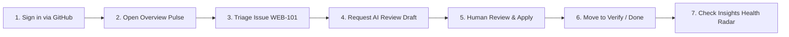
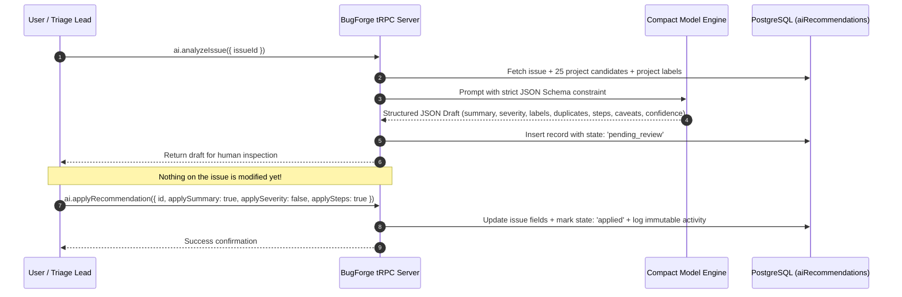
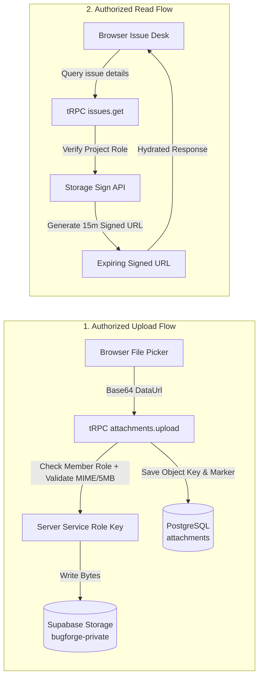
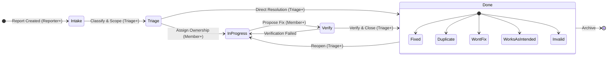
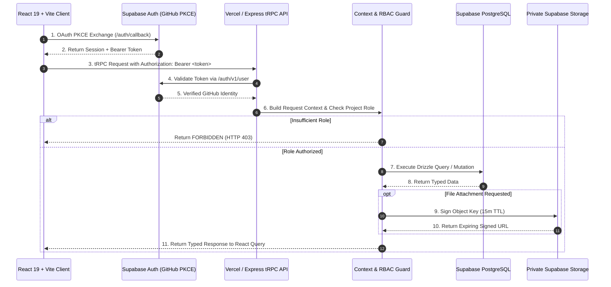

# 🏛️ BugForge — Modern Issue Intelligence & Defect Governance

[](https://bugforge-lyart.vercel.app)
[](https://react.dev/)
[](https://www.typescriptlang.org/)
[](https://trpc.io/)
[](https://www.postgresql.org/)
[](https://orm.drizzle.team/)
[](https://supabase.com/)
[](#-automated-test-suite)
[](LICENSE)

> **Modern issue intelligence for teams that need clarity, not ceremony.**
>
> **BugForge** is a ground-up reconstruction of the foundational defect-tracking workflow established by Bugzilla — capturing, classifying, assigning, discussing, verifying, resolving, and learning from issues — rebuilt from scratch with a calm, high-craft editorial design system, keyboard-first command ergonomics, deterministic release governance math, zero-leakage private storage, and human-reviewed AI triage assistance.

---

## 📑 Table of Contents

1. [⚡ Quick Start for Judges](#-quick-start-for-judges)
2. [🧭 Worked Example — One Issue, Start to Finish](#-worked-example--one-issue-start-to-finish)
3. [🖼️ Visual Tour & Interface Evidence](#️-visual-tour--interface-evidence)
4. [🏆 The 5 Core Algorithmic & Security Moats](#-the-5-core-algorithmic--security-moats)
5. [💻 Modern Developer Ergonomics](#-modern-developer-ergonomics)
6. [🔄 Issue Lifecycle & State Machine](#-issue-lifecycle--state-machine)
7. [🏗️ Architecture & Request Topology](#️-architecture--request-topology)
8. [🔐 Authentication & Security Model](#-authentication--security-model)
9. [🧪 Automated Test Suite](#-automated-test-suite)
10. [💻 Local Development & Commands](#-local-development--commands)
11. [⚙️ Environment Configuration](#️-environment-configuration)
12. [📚 Documentation Index](#-documentation-index)
13. [📄 License and Attribution](#-license-and-attribution)

---

## ⚡ Quick Start for Judges

### 🌐 Option 1 — Live Hosted Sandbox (Zero Setup, Instant)

Everything is deployed, connected, and ready to evaluate right now on Vercel with dedicated Supabase PostgreSQL and private Storage:

| Resource | Link | Description |
|---|---|---|
| **Live Web Application** | [https://bugforge-lyart.vercel.app](https://bugforge-lyart.vercel.app) | Production deployment hosted on Vercel Edge/Serverless |
| **Authentication** | **1-Click Continue with GitHub** | Supabase Auth with PKCE flow; automatic personal workspace initialization on first sign-in |
| **Pre-Seeded Demo Fixture** | [`docs/evaluator-demo.md`](docs/evaluator-demo.md) | **Northstar Demo Workspace** (`WEB` project) with 8 synthetic issues across all 5 workflow states |
| **System Health Endpoint** | [`/api/trpc/system.health`](https://bugforge-lyart.vercel.app/api/trpc/system.health) | Bounded status check verifying live Supabase PostgreSQL connectivity without exposing credentials |

> **Synthetic Dataset Notice**: The pre-seeded evaluator records (`WEB-101` through `WEB-108`) contain synthetic issues across all lifecycle lanes, private storage attachments, threaded comments, member mentions, and an AI triage draft. No real customer or production data is implied. See [`docs/evaluator-demo-dataset.json`](docs/evaluator-demo-dataset.json).

---

### 🧪 Option 2 — Run All 34 Automated Tests (< 3 Seconds)

Verify every authorization gate, workspace cascade safeguard, avatar signed-URL hydration, and personalization persistence rule locally:

```bash
git clone https://github.com/Simondavid07/bugforge.git
cd bugforge
pnpm install
pnpm test
```

> **Result**: 34 unit and integration tests across 15 test files pass in ~2.8s with zero flaky mocks. See [Automated Test Suite](#-automated-test-suite) for the complete breakdown.

---

### 🖥️ Option 3 — Run Locally

```bash
git clone https://github.com/Simondavid07/bugforge.git
cd bugforge
pnpm install
pnpm dev
```

Open the printed local URL (e.g. `http://localhost:3000`). Development runs Vite HMR paired with the local Express server; production compiles into static assets and serverless handler modules.

---

## 🧭 Worked Example — One Issue, Start to Finish

Follow this 2-minute walkthrough on the live demo to experience BugForge's full workflow:



1. **Sign In & Orientation**: Click **Continue with GitHub** at [`bugforge-lyart.vercel.app`](https://bugforge-lyart.vercel.app). You land on the **Overview** screen displaying the active project (`WEB`), current sprint readiness radar, severity pulse, and next moves queue.
2. **Discover via Keyboard (`⌘K`)**: Press `Cmd/Ctrl + K` to trigger the **Spotlight Command Palette**. Type `WEB-101` or search `"focus"` to jump straight to issue `WEB-101` (*"Keyboard focus is lost after saving a saved search"*).
3. **Inspect the Structured Reproduction Kit**: Notice the clear separation of *Expected Result*, *Actual Result*, *Environment*, and *Reproducible Steps*.
4. **Trigger Human-in-the-Loop AI Triage**: Click **AI review draft**. The model analyzes the issue context against 25 prior project issues and generates a draft: concise summary, suggested severity (`major`), relevant labels (`accessibility`, `navigation`), duplicate candidate check, and cleaned reproduction steps.
5. **Human Decision Gate**: Notice that **nothing is auto-applied**. Toggle which fields you approve and click **Apply selected**. The immutable audit ledger records `ai.recommendation_applied`.
6. **Workflow State Transition**: Move the issue from **Intake** ➔ **Triage** ➔ **In Progress** ➔ **Verify** ➔ **Done**. When selecting **Done**, notice that the system strictly requires a resolution code (`Fixed`, `Duplicate`, `Won't fix`, `Works as intended`, or `Invalid`).
7. **Collaboration & Mention**: Add a comment typing `@member-1`. The member receives an instant in-app notification in **Inbox**.
8. **Private Evidence Attachment**: Upload a test screenshot or log file in the Evidence panel. BugForge streams it to private Supabase Storage and resolves it to a short-lived signed URL (15m TTL).
9. **Inspect Project Health**: Navigate to **Workboard** (`/boards`) to see the issue in the **Done** lane, then open **Insights** (`/analytics`) to see the updated release-readiness score and throughput velocity.
10. **Personalize Your Studio**: Open the floating **Personalize** dock in the bottom-right corner. Change the project accent color (e.g. Sage `#75937E`), reorder your navigation, or adjust motion physics (`Still`, `Soft`, `Expressive`).

---

## 🖼️ Visual Tour & Interface Evidence

BugForge features a warm **editorial correspondence aesthetic** — combining paper textures, deep ink typography, terracotta, rose, sage, and dusty-gold accents with strict accessibility, visible focus indicators, and reduced-motion safety.

| Overview — Dark Appearance | Overview — Light Appearance |
| :---: | :---: |
| [](docs/assets/product-tour/overview-dark.png) | [](docs/assets/product-tour/overview-light.png) |
| *Deep ink surfaces, readable pastel status cards, Quick find, New issue modal, and project context.* | *High-contrast paper surfaces, semantic status chips, release readiness gauge, and next-action queue.* |

| Workboard — Light Appearance | Insights — Dark Appearance |
| :---: | :---: |
| [](docs/assets/product-tour/workboard-light.png) | [](docs/assets/product-tour/insights-dark.png) |
| *Five workflow lanes (**Intake**, **Triage**, **In progress**, **Verify**, **Done**) with role-aware moves.* | *Project health summary: open issues, throughput velocity, release blockers, severity mix, and aging.* |

*Full visual mapping and screen-to-code traceability: [`docs/product-tour.md`](docs/product-tour.md).*

---

## 🏆 The 5 Core Algorithmic & Security Moats

### 1. 🤖 Human-in-the-Loop AI Triage (Strict JSON Schema, Zero Autopilot)

Unlike chatbots that hallucinate changes, BugForge enforces a **strict human trust boundary**.



- **Strict Structured Output**: The model response is constrained via JSON Schema specifying exact keys: `summary`, `suggestedSeverity`, `suggestedLabels`, `duplicateCandidates` (containing target `issueId` and `reason`), `reproducibleSteps`, `caveats`, and integer `confidence` (0–100%).
- **Duplicate Candidate Cross-Referencing**: The server supplies up to 25 recent project issues in the prompt context so the model identifies plausible duplicates against real active records.
- **Explicit Human Gate**: Every recommendation is persisted in `aiRecommendations` with state `pending_review`. The user selects exactly which fields to apply via checkboxes (`applySummary`, `applySeverity`, `applySteps`).

---

### 2. 🛡️ Server-Enforced RBAC & Zero-Trust Architecture

Client-side hidden buttons are purely for visual comfort; **every tRPC procedure independently verifies project/workspace membership and role rank on the server** before touching the database or storage.

```
       WORKSPACE ROLES                    PROJECT ROLES (Role Rank Ladder)
┌───────────────────────────┐     ┌──────────────────────────────────────────────┐
│ Admin  (Full governance)  │     │ Admin (4)   ➔ Full project settings & accents│
│ Member (Standard member)  │     │ Triage (3)  ➔ Transitions, assign, blockers │
│ Viewer (Read-only access) │     │ Member (2)  ➔ Edit issue details & comments  │
└───────────────────────────┘     │ Reporter (1)➔ Create issues & own comments   │
                                  │ Viewer (0)  ➔ Scoped read-only access        │
                                  └──────────────────────────────────────────────┘
```

- **Role Inheritance**: Workspace administrators automatically inherit `admin` rights on all workspace projects.
- **Fail-Safe Authorization**: Procedures call `requireProjectRole(userId, projectId, minimumRole)`. Insufficient permissions immediately raise `TRPCError({ code: "FORBIDDEN" })`.
- **Defense-in-Depth**: Row-Level Security (RLS) is enabled on all PostgreSQL public tables in Supabase as an extra security perimeter.

---

### 3. 🔒 Zero-Leakage Private Storage with Expiring Signed Reads

BugForge completely eliminates public bucket data leaks for attachments, project branding, and user avatars.



- **No Public Storage URLs**: The database stores opaque URI markers (`supabase-storage://bugforge-private/<key>`).
- **Short-Lived Signed URLs**: On read, the server generates a cryptographically signed URL with a **15-minute Time-To-Live (TTL)**.
- **Type & Size Whitelisting**: Strictly permits only `image/png`, `image/jpeg`, `image/webp`, `text/plain`, `application/json`, and `application/pdf` up to **5 MB** (attachments) or **2 MB** (avatars/logos).

---

### 4. 📊 Deterministic Release-Readiness & Health Analytics

Instead of vague status summaries, BugForge uses inspectable mathematical formulas to compute project health, sprint blockers, and aging debt in [`server/db.ts`](server/db.ts) and [`client/src/pages/Home.tsx`](client/src/pages/Home.tsx):

$$\text{Release Readiness (\%)} = \max\Big(0, \min\big(100, 100 - (18 \times \text{blockers}) - (4 \times \text{untriaged}) - (6 \times \text{overdue})\big)\Big)$$

- **Release Blocker Penalty ($18\text{ pts}$)**: Critical bugs marked `isReleaseBlocker = true` or `severity = blocker`.
- **Triage Debt Penalty ($4\text{ pts}$)**: Unscoped incoming reports lingering in `status = intake`.
- **Overdue Penalty ($6\text{ pts}$)**: Open issues where `dueAt < NOW()`.
- **Aging Triage Lanes**: Discrete tracking buckets for issues open $>7\text{ days}$, $>14\text{ days}$, and $>30\text{ days}$.
- **Throughput Velocity**: Rolling 14-day count of verified closed issues ($t_{\text{resolved}} \le 14\text{ days}$).

---

### 5. ⌨️ Keyboard-First Ergonomics & Correspondence Design System

- **Spotlight Command Palette (`Cmd/Ctrl + K`)**: Built with `cmdk`, featuring fuzzy route jumping, quick filter presets (*Untriaged*, *Critical*, *Blockers*), project switching with visual accents, and instant saved query execution.
- **Custom Precision Cursor**: Physics-based desktop cursor with trailing spring interpolation (`rx += (x - rx) * 0.16`), interactive hover expansion, and automatic bypass when `prefers-reduced-motion: reduce` or touch input is detected.
- **Dynamic Accent Color Engine**: Project administrators select custom brand accents (`#A55343`, `#75937E`, `#C9A46A`, etc.) that dynamically inject `--project-accent` CSS custom properties into workspace lane headers, borders, and navigation.

---

## 💻 Modern Developer Ergonomics

| Feature | Implementation | Developer Value |
|---|---|---|
| **Spotlight Command Palette** | `cmdk` + Lucide | Instant `⌘K` jump to routes, projects, issue filters, or saved searches |
| **5-Lane Workflow Board** | CSS Grid + Dynamic Theme Tokens | Clear stage visualization with blocker badges and direct detail links |
| **Threaded Discussion & @Mentions** | Regex `@member-(\d+)` parser | Scoped team communication with real-time in-app notification routing |
| **Relational Issue Linking** | `issueLinks` with Unique Constraint | Bi-directional relationship tracking: `relates_to`, `duplicates`, `blocked_by`, `blocks` |
| **Immutable Audit History** | Append-only `issueActivity` table | Permanent tamper-proof audit trail for transitions, comments, attachments, and AI reviews |
| **Custom Saved Filter Views** | `savedViews` + `userPreferences` | Personal query presets saved per user/project, syncing with URL query params |
| **Personalization Dock** | Floating accessible drawer | Custom project accents, logo/avatar uploads, motion tuning, and reorderable menus |

---

## 🔄 Issue Lifecycle & State Machine

Every status change is verified against project permissions and state integrity constraints:



### State Transition Matrix

| Current State | Target State | Required Role | Required Fields & Validation Rules | Resulting Actions |
|---|---|---|---|---|
| **Intake** | **Triage** | `triage` or `admin` | Valid issue ID; project membership | Sets `triagedAt = NOW()`, records activity |
| **Triage** | **In progress** | `member`, `triage`, `admin` | Valid issue ID | Assignee can be set; records activity |
| **In progress** | **Verify** | `member`, `triage`, `admin` | Valid issue ID | Signals work is ready for testing |
| **Verify** | **Done** | `triage` or `admin` | **Mandatory Resolution**: `fixed`, `duplicate`, `wont_fix`, `invalid`, or `works_as_intended` | Sets `resolvedAt = NOW()`, notifies watchers |
| **Done** | **In progress** | `triage` or `admin` | Reopen action | Clears `resolution` to `null`, clears `resolvedAt` |

> **Error Handling**: An attempt to transition to `done` without a resolution code triggers HTTP 400 (`BAD_REQUEST: "A resolution is required before closing an issue."`). An unauthorized attempt triggers HTTP 403 (`FORBIDDEN: "You do not have permission to access this project."`).

---

## 🏗️ Architecture & Request Topology

BugForge uses a shared TypeScript codebase connecting a React 19 frontend with an Express/tRPC serverless backend:



### Directory Structure

```
bugforge/
├── client/                     # React 19 + Vite Single Page Application
│   ├── src/
│   │   ├── _core/hooks/        # useAuth (Supabase session synchronization)
│   │   ├── components/         # CommandPalette, ProjectPersonalization, DashboardLayout, UI
│   │   ├── contexts/           # ThemeContext (Light / Dark mode persistence)
│   │   ├── hooks/              # useActiveProject, useComposition, useCorrespondenceSurface
│   │   ├── lib/                # tRPC client, Supabase client, formatting helpers
│   │   └── pages/              # Home (Overview), IssueExplorer, IssueDetail, Boards, Analytics, Inbox
│   └── index.html              # HTML entry point with metadata
├── server/                     # Express + tRPC API Layer
│   ├── _core/                  # app.ts (shared app factory), context.ts, trpc.ts, supabaseAuth.ts, llm.ts
│   ├── db.ts                   # Drizzle ORM queries, PostgreSQL connection pooler, RBAC helpers
│   ├── routers.ts              # tRPC router definitions (auth, workspace, project, issues, views, etc.)
│   ├── storage.ts              # Private Supabase Storage adapter & signed URL resolver
│   └── *.test.ts               # Vitest unit & integration test suites
├── drizzle/                    # Database definitions & migrations
│   ├── schema.ts               # PostgreSQL Drizzle Schema (16 tables)
│   └── *.sql                   # Generated migration files
├── shared/                     # Shared constants, enums, and types
├── tests/e2e/                  # Playwright end-to-end tests (GitHub Auth setup & flow)
├── docs/                       # Complete engineering & architectural documentation (26+ guides)
└── api/                        # Vercel Serverless Function entry point ([...path].ts)
```

---

## 🔐 Authentication & Security Model

- **GitHub OAuth via Supabase Auth**: End users authenticate using GitHub through PKCE. No raw GitHub client secrets ever touch client bundles or repository code.
- **Single Source of Truth (`server/_core/supabaseAuth.ts`)**: Every protected tRPC call verifies the Supabase access token via HTTPS against `/auth/v1/user`, mapping confirmed email identities to internal user IDs.
- **Zero-Trust Database Pool**: PostgreSQL is queried over an SSL-encrypted transaction pooler (`Pool` with `ssl: { rejectUnauthorized: false }`). Max connection limits are constrained to 1 on serverless to avoid connection exhaustion.
- **Cascade Deletion Safeguards**: Deleting a workspace requires typing the exact workspace name and is wrapped in a single database transaction deleting all child issues, attachments, comments, watchers, links, and members atomically.

---

## 🧪 Automated Test Suite

```bash
pnpm test
```

### Test Suite Summary

| Layer / Test File | Focus Area | Assertions | Status |
|---|---|:---:|:---:|
| `server/routers.authorization.test.ts` | Procedure role requirements & unauthorized rejection | 3 | ✅ Pass |
| `server/routers.project-scope.test.ts` | Project-scoped isolation & cross-tenant barrier | 5 | ✅ Pass |
| `server/db.permissions.test.ts` | Role rank calculations (`roleCan`) | 4 | ✅ Pass |
| `server/db.workspace-delete.test.ts` | Safe cascade workspace deletion & database offline guard | 3 | ✅ Pass |
| `server/db.connection-source.test.ts` | PostgreSQL connection string resolution priority | 3 | ✅ Pass |
| `server/supabase.connection.test.ts` | Supabase URL parsing & environment fallback | 2 | ✅ Pass |
| `server/supabaseAuth.avatar.test.ts` | Provider avatar seeding & private marker preservation | 2 | ✅ Pass |
| `server/storage.supabase.test.ts` | Private bucket marker resolution & signed URL format | 2 | ✅ Pass |
| `server/supabaseStorage.config.test.ts` | Service role key configuration enforcement | 2 | ✅ Pass |
| `server/auth.avatar-url.test.ts` | Avatar hydration to short-lived signed URLs | 1 | ✅ Pass |
| `server/auth.logout.test.ts` | Session cookie clearing & revocation | 1 | ✅ Pass |
| `server/_core/systemRouter.test.ts` | Bounded public health endpoint response | 1 | ✅ Pass |
| `server/_core/vercelRoute.test.ts` | Serverless handler mounting contract | 1 | ✅ Pass |
| `client/src/components/CommandPalette.test.ts` | Saved search URL parameter construction | 2 | ✅ Pass |
| `client/src/components/ProjectPersonalization.test.ts` | Hex color validation & CSS variable injection | 2 | ✅ Pass |
| **Total Automated Coverage** | **15 Test Files** | **34 Tests** | **✅ 100% Passing** |

---

## 💻 Local Development & Commands

### Useful Commands

| Command | Purpose |
|---|---|
| `pnpm dev` | Start local development server with Vite HMR and Express API |
| `pnpm test` | Run complete Vitest suite |
| `pnpm check` | Run strict TypeScript compiler verification (`tsc --noEmit`) |
| `pnpm build:vercel` | Build client SPA and serverless bundle for Vercel production |
| `pnpm build:managed` | Build bundle for standalone / managed runtime (rollback target) |
| `pnpm format` | Format entire repository using Prettier |
| `pnpm db:generate` | Generate Drizzle migration SQL from `drizzle/schema.ts` |
| `pnpm e2e` | Run Playwright test suite |

---

## ⚙️ Environment Configuration

| Variable | Scope | Description |
|---|---|---|
| `SUPABASE_DATABASE_URL` | Server Only | Password-bearing PostgreSQL transaction-pooler connection string |
| `SUPABASE_SERVICE_ROLE_KEY` | Server Only | Supabase Service Role Key for private bucket uploads and signed URLs |
| `SUPABASE_STORAGE_BUCKET` | Server Only | Private Storage bucket name (default: `bugforge-private`) |
| `SUPABASE_URL` | Server Only | Supabase project URL (`https://zznvjtdspjampmztrunx.supabase.co`) |
| `VITE_SUPABASE_URL` | Browser Safe | Client-side Supabase project endpoint |
| `VITE_SUPABASE_PUBLISHABLE_KEY` | Browser Safe | Client-side Supabase publishable anonymous key |
| `JWT_SECRET` | Server Only | Secret key for signing session tokens |

---

## 📚 Documentation Index

The repository contains 26 comprehensive technical documentation guides:

| Document | Description |
|---|---|
| [`docs/visuals.md`](docs/visuals.md) | **Primary System Graph**: Complete Mermaid sequence diagrams, ER diagrams, RBAC charts, and request flows |
| [`docs/architecture.md`](docs/architecture.md) | Runtime topology, domain model, role ladders, and deployment boundaries |
| [`docs/product-tour.md`](docs/product-tour.md) | Captioned screenshots mapping Overview, Workboard, and Insights to source code |
| [`docs/evaluator-demo.md`](docs/evaluator-demo.md) | Synthetic evaluator dataset (`WEB-101` to `WEB-108`) and judge runbook |
| [`docs/performance-evidence.md`](docs/performance-evidence.md) | Measured Vercel build benchmarks, bundle chunks, and accessibility evidence |
| [`docs/api.md`](docs/api.md) | Complete tRPC namespace specification and AI JSON schema contract |
| [`docs/security.md`](docs/security.md) | Identity boundaries, RBAC matrix, RLS policies, and AI safety model |
| [`docs/storage.md`](docs/storage.md) | Private Supabase Storage lifecycle, marker formats, and signed URL generation |
| [`docs/github-auth.md`](docs/github-auth.md) | GitHub OAuth setup with Supabase Auth, PKCE contract, and verification records |
| [`docs/database-migration.md`](docs/database-migration.md) | PostgreSQL schema, Drizzle migrations, parity verification, and rollback safety |
| [`docs/setup.md`](docs/setup.md) | Prerequisites, local installation, and environment configuration |
| [`docs/deployment.md`](docs/deployment.md) | Vercel production release procedure, health check endpoints, and rollback steps |
| [`docs/testing.md`](docs/testing.md) | Test suite organization, Vitest assertions, and Playwright verification |
| [`docs/troubleshooting.md`](docs/troubleshooting.md) | Diagnostics for authentication, database connection, storage, and build issues |
| [`docs/submission-ready-brief.md`](docs/submission-ready-brief.md) | Challenge-aligned product statement, evaluation map, and design rationale |

---

## 📄 License and Attribution

BugForge is open-source software licensed under the [MIT License](LICENSE).

*This project is an independent product and engineering reconstruction inspired by the problem domain of Bugzilla. It is not an official Bugzilla project and does not reproduce Bugzilla's legacy UI or Perl source code.*
