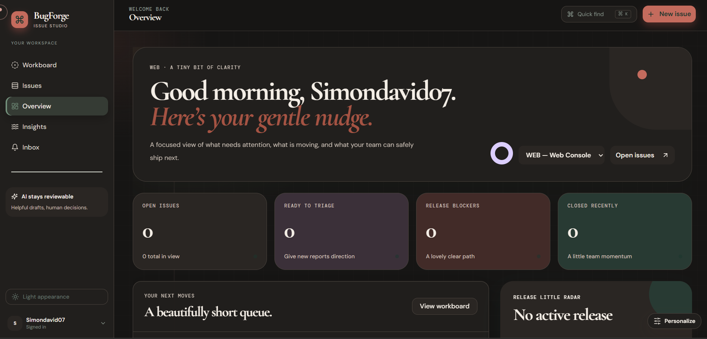
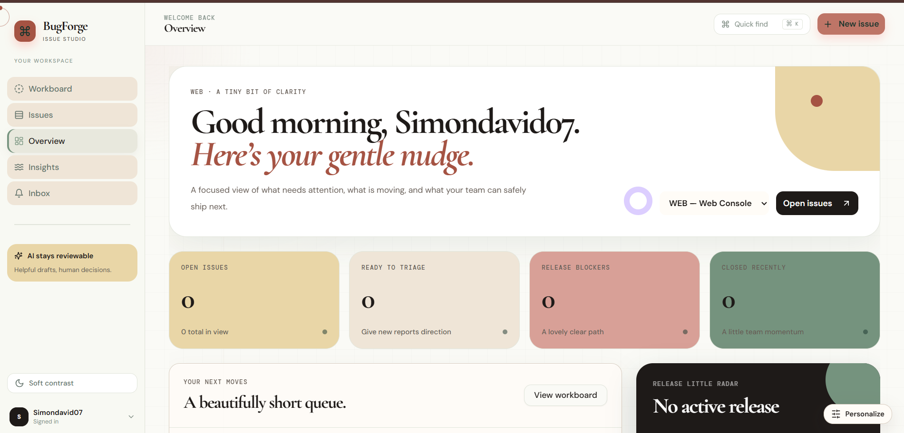
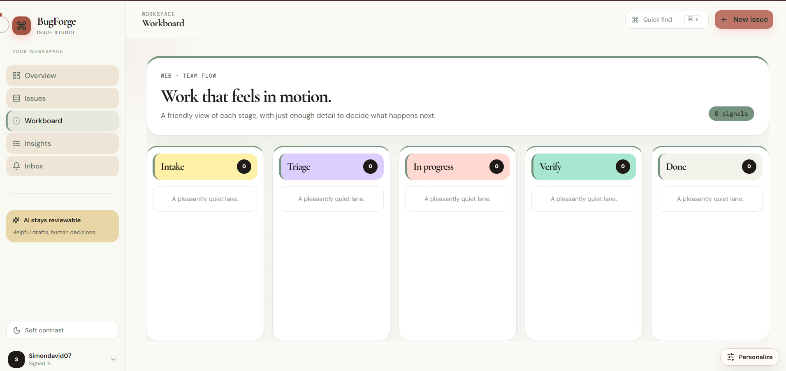
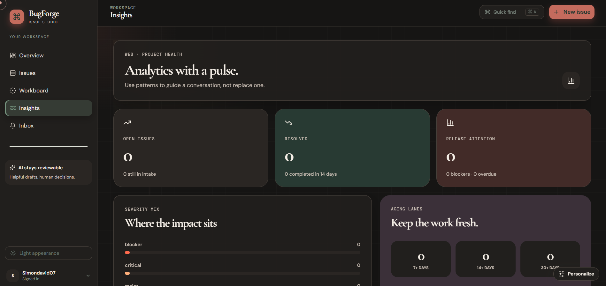

# BugForge

> **Modern issue intelligence for teams that need clarity, not ceremony.**

BugForge is a Bugzilla-inspired issue-tracking platform rebuilt around a calm, collaborative workspace. It turns incoming reports into structured, project-scoped work, then connects triage, delivery, verification, collaboration, analytics, and notifications in one focused experience.

The product is intentionally an independent reconstruction rather than a Bugzilla clone. It keeps the underlying software-lifecycle problem—capturing, prioritizing, assigning, discussing, resolving, and learning from defects—while rethinking the interaction model with a responsive editorial interface, keyboard-first discovery, project personalization, and human-reviewed AI assistance.

## Product highlights

| Area                 | What BugForge provides                                                                                                                                                                               |
| -------------------- | ---------------------------------------------------------------------------------------------------------------------------------------------------------------------------------------------------- |
| Issue lifecycle      | Structured reports with severity, priority, status, assignee, reporter, labels, components, milestones, descriptions, reproducible steps, relationships, and immutable activity history.             |
| Collaboration        | Threaded comments, safe mentions, watchers, related and duplicate links, attachment metadata, and in-app notifications.                                                                              |
| Workflow             | Five visible lanes—**Intake**, **Triage**, **In progress**, **Verify**, and **Done**—with permission-aware transitions and resolution metadata.                                                      |
| Discovery            | Search, filters, sorting, pagination, saved searches, quick filters, and a Cmd/Ctrl+K command palette for routes, projects, and recent issues.                                                       |
| Planning and insight | Personal and team boards, triage debt, overdue work, release blockers, severity distribution, issue aging, throughput, and release-readiness signals.                                                |
| Personalization      | Light and dark themes, project accent colors, custom avatars and project logos, reorderable navigation and projects, and still/soft/expressive motion preferences.                                   |
| Intelligence         | Compact structured recommendations for summaries, severity, labels, duplicate candidates, and reproducible steps. AI output is always a draft and requires explicit human review before application. |
| Security             | Supabase Auth GitHub login, server-side bearer validation, workspace/project RBAC, private Supabase Storage, signed reads, input validation, PostgreSQL RLS, and protected runtime secrets.          |

## Screens and workflow

A signed-in user enters a workspace overview that surfaces the next useful action instead of an undifferentiated dashboard. **Issues** is the searchable discovery surface. **Workboard** groups signals by lifecycle stage. **Insights** turns issue data into health and release conversations. **Inbox** collects in-app notifications. The issue desk combines evidence, discussion, workflow controls, links, and reviewable recommendations.

The visual system uses warm paper, deep ink, terracotta, rose, sage, and dusty-gold accents with editorial serif display type and a quiet sans-serif interface. Motion is restrained, keyboard reachable, and reduced-motion aware. The interface is designed to feel composed at both desktop and mobile widths rather than treating responsive behavior as a later adaptation.

### Product tour

The following captures are owner-provided interface evidence from the implemented BugForge workspace. They show the same product language across light and dark themes, including the Overview, five-stage Workboard, and Insights health surface. The empty values are intentionally preserved from the captured workspace and do not represent production usage metrics.

| Overview — dark appearance | Overview — light appearance |
| --- | --- |
| [](docs/assets/product-tour/overview-dark.png) | [](docs/assets/product-tour/overview-light.png) |
| Deep ink surfaces, readable pastel status cards, Quick find, New issue, project context, and Personalize. | Paper surfaces, high-contrast ink, semantic pastel status cards, and the same workspace hierarchy. |

| Workboard — light appearance | Insights — dark appearance |
| --- | --- |
| [](docs/assets/product-tour/workboard-light.png) | [](docs/assets/product-tour/insights-dark.png) |
| Five workflow lanes: **Intake**, **Triage**, **In progress**, **Verify**, and **Done**. | Project-health summary with open issues, resolved work, release attention, severity mix, and aging lanes. |

For route-level captions, source-file mapping, accessibility notes, and screenshot limitations, see the complete [`docs/product-tour.md`](docs/product-tour.md). For the system relationships behind these screens, see [`docs/visuals.md`](docs/visuals.md).

## Architecture

BugForge is a monorepo-style TypeScript application with a React/Vite client and an Express/tRPC server. The server exposes typed procedures under `/api/trpc`; Drizzle ORM maps the domain model to PostgreSQL; Supabase Auth supplies the end-user identity boundary; Supabase Storage stores private image and attachment bytes; Vercel hosts the external production build; and the managed runtime remains available as rollback.

```text
Browser
  ├─ Supabase Auth: GitHub OAuth + PKCE session
  ├─ React 19 + Vite + Wouter
  └─ tRPC client with current Supabase bearer token
              │
              ▼
Vercel / Express serverless API
  ├─ Request context + Supabase Auth verification
  ├─ tRPC procedures + Zod validation
  ├─ Project/workspace RBAC checks
  ├─ Drizzle ORM + node-postgres
  └─ Server-only Supabase Storage signed URLs
              │
              ├─ Supabase PostgreSQL (BugForge data)
              ├─ Supabase Storage (`bugforge-private`)
              └─ Managed deployment/database (rollback only)
```

The server boundary is deliberately authorization-first: a request must be authenticated, the requested project must be resolved, and the caller’s workspace or project role must permit the operation before project data or signed storage URLs are returned. Client controls improve usability but never replace server authorization.

## Authentication

End users select **Continue with GitHub**. The browser uses the Supabase JavaScript client with PKCE, exchanges the callback code once at `/auth/callback`, and retains the Supabase session. The tRPC bootstrap forwards the current access token as a Bearer header. The server validates that token against Supabase Auth, resolves the GitHub identity, and preserves BugForge membership and role data.

The GitHub OAuth provider callback belongs to the Supabase Auth project, not to BugForge’s Vercel server. The browser redirect is the Vercel `/auth/callback` route configured as an allowed Supabase redirect. No GitHub client secret belongs in this repository or in browser-exposed environment variables.

See [`docs/github-auth.md`](docs/github-auth.md) for the configuration contract and verification record.

## Data and storage

BugForge uses the dedicated Supabase PostgreSQL project for external production data. The application stores timestamps as UTC Unix milliseconds at the API/database boundary and converts them for local display. The schema includes workspace, project, membership, issue, collaboration, notification, personalization, and recommendation records.

The `bugforge-private` Supabase Storage bucket is private. Uploads occur server-side only after the existing project/workspace permission checks. PostgreSQL stores a `supabase-storage://...` marker and object key rather than a permanent public URL. Authorized reads receive a short-lived signed URL. Legacy managed-storage paths remain readable for rollback compatibility, but new private assets use Supabase Storage.

See [`docs/database-migration.md`](docs/database-migration.md) and [`docs/storage.md`](docs/storage.md).

## Local development

### Prerequisites

Use Node.js 22 or a compatible current LTS release, pnpm 10, and a PostgreSQL connection string for a development or dedicated Supabase database. Never commit `.env` files, database passwords, service-role keys, OAuth secrets, or migration snapshots containing customer data.

### Install and run

```bash
pnpm install
pnpm dev
```

The managed development server starts the Express/Vite application. The exact local port is supplied by the runtime and should not be hard-coded into application code.

### Useful commands

| Command              | Purpose                                                                                   |
| -------------------- | ----------------------------------------------------------------------------------------- |
| `pnpm check`         | TypeScript validation with no emit.                                                       |
| `pnpm test`          | Run the complete Vitest suite once.                                                       |
| `pnpm build:vercel`  | Build the Vite client and serverless deployment artifact.                                 |
| `pnpm build:managed` | Build the managed runtime artifact used for rollback.                                     |
| `pnpm format`        | Format source files with the repository Prettier configuration.                           |
| `pnpm db:generate`   | Generate Drizzle migration SQL from the TypeScript schema. Review SQL before applying it. |
| `pnpm e2e`           | Run the Playwright suite when the authenticated test session is configured.               |

Database changes are schema-first. Update `drizzle/schema.ts`, generate and review SQL, apply the migration through the approved database workflow, and then verify the resulting tables and constraints. Do not run destructive SQL against the dedicated or rollback database without an explicit recovery plan.

## Required runtime configuration

Values are injected through protected environment settings. The exact Supabase URL, keys, database password, JWT secret, and OAuth provider secrets must never be placed in source control or pasted into issue comments.

| Variable                                       | Scope        | Purpose                                                                         |
| ---------------------------------------------- | ------------ | ------------------------------------------------------------------------------- |
| `SUPABASE_DATABASE_URL`                        | Server       | Password-bearing transaction-pooler URL for PostgreSQL.                         |
| `SUPABASE_SERVICE_ROLE_KEY`                    | Server only  | Private Storage server operations and signed URLs. Never expose to the browser. |
| `SUPABASE_STORAGE_BUCKET`                      | Server       | Private bucket name; production uses `bugforge-private`.                        |
| `VITE_SUPABASE_URL` / `VITE_SUPABASE_ANON_KEY` | Browser-safe | Supabase Auth client configuration, if provided by the deployment template.     |
| `JWT_SECRET`                                   | Server       | Session and framework signing support.                                          |
| `VITE_APP_TITLE` / `VITE_APP_LOGO`             | Browser-safe | Site branding.                                                                  |

GitHub OAuth provider credentials are configured in Supabase Auth. The managed Forge AI credential is intentionally not copied into the external Vercel deployment; the existing managed AI workflow remains the rollback/runtime path and is always reviewable.

## Deployment

The production site is deployed at [bugforge-lyart.vercel.app](https://bugforge-lyart.vercel.app) from the `main` branch of `Simondavid07/bugforge` on GitHub. Vercel routes `/api/*` to the serverless API catch-all and non-API paths to the Vite SPA. `server/_core/app.ts` is shared by Vercel and the managed runtime so deployment-specific bootstrapping stays isolated.

The external deployment uses Supabase PostgreSQL and private Supabase Storage. The managed MySQL/TiDB deployment and database remain intact as rollback. Publishing is performed from the project’s deployment controls after a reviewed checkpoint; do not delete the managed runtime until the owner has separately approved that change.

See [`docs/deployment.md`](docs/deployment.md), [`docs/production-readiness.md`](docs/production-readiness.md), and [`docs/vercel-deployment-status.md`](docs/vercel-deployment-status.md).

## Testing and verification

The repository uses TypeScript, Vitest, and Playwright. Tests cover authorization thresholds, workspace deletion safeguards, Supabase connection behavior, personalization persistence, upload validation, saved searches, authentication synchronization, private-storage round-trips, and browser-safe signed-avatar hydration. The release process also checks both Vercel and managed builds, API health, authenticated navigation, responsive layout, and reduced-motion behavior.

The latest verified milestone includes a ready Vercel production deployment, an authenticated GitHub/Supabase session, PostgreSQL connectivity, a successful private avatar upload and signed read, persistent project accent selection, the full TypeScript check, and the complete Vitest suite. AI recommendations remain human-reviewed and the external Vercel AI Gateway is intentionally not activated.

## Security boundaries

BugForge follows least privilege at the application boundary. Every project procedure resolves membership and role on the server. Private Storage has no permissive browser policy; the service-role key is server-only. The browser receives only short-lived signed URLs after authorization. Public system health exposes connection status but not credentials or data. RLS is enabled on the exposed Supabase public tables as defense in depth, while the application continues to use the server-side database connection for typed, authorized access.

Do not treat a recommendation as an automatic change. Do not treat release-readiness percentages as guarantees. Encryption, access controls, and signed URLs do not prevent screenshots, copying of plaintext, or compromised client devices.

See [`docs/security.md`](docs/security.md) and [`docs/troubleshooting.md`](docs/troubleshooting.md).

## Submission context

BugForge addresses the challenge of reconstructing the essential developer workflow behind Bugzilla without reproducing its legacy interface. The implementation demonstrates an independent product interpretation with a modern stack, clear domain boundaries, project-scoped RBAC, collaborative issue intelligence, analytics, personalization, responsive interaction design, and honest AI review controls.

See [`docs/submission-ready-brief.md`](docs/submission-ready-brief.md) for a concise evaluation-oriented summary, [`docs/product-tour.md`](docs/product-tour.md) for owner-provided interface screenshots, [`docs/architecture.md`](docs/architecture.md) for system design, [`docs/visuals.md`](docs/visuals.md) for diagrams and the procedure chart, and [`docs/demo-script.md`](docs/demo-script.md) for a suggested walkthrough.

## Contributing

Read [`CONTRIBUTING.md`](CONTRIBUTING.md) before opening a change. Keep procedures project-scoped, add tests for authorization and persistence behavior, preserve the managed rollback path, and update the relevant documentation when a feature changes an operational or security boundary.

## License and attribution

This repository is an independent educational/product reconstruction inspired by the problem domain addressed by Bugzilla. It is not an official Bugzilla project and does not reproduce Bugzilla’s UI or source implementation. Consult the repository owner for the applicable project license and distribution terms.

## References

[1]: https://github.com/bugzilla/bugzilla "Bugzilla reference repository"
[2]: https://supabase.com/docs/guides/auth/social-login/auth-github "Supabase Auth: Login with GitHub"
[3]: https://supabase.com/docs/guides/storage "Supabase Storage documentation"
[4]: https://vercel.com/docs/routing/rewrites "Vercel routing and rewrites"
[5]: https://orm.drizzle.team/docs/overview "Drizzle ORM documentation"
