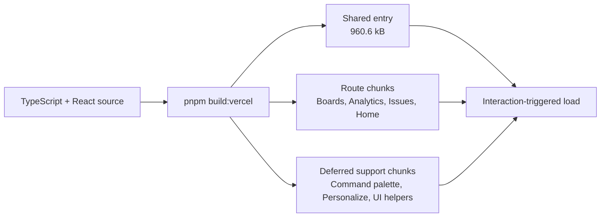

# Performance and accessibility evidence

This page records a reproducible build-level performance baseline for BugForge. The measurements describe the generated Vercel artifact and repository checks; they are not a substitute for field telemetry or a browser Lighthouse run on a production account.

## Measurement record

| Measurement | Result | Method and scope |
| --- | ---: | --- |
| Vercel build completion | **Pass** | `pnpm build:vercel` completed successfully. |
| Build wall-clock time | **7.70 s** | Shell `time -p`, measured on 2026-08-30 at `11:21:12Z`; local build host, not an SLA. |
| Transformed modules | **1,838** | Vite production build output. |
| JavaScript route/chunk files | **16** | Counted under `dist/assets/*.js`. |
| JavaScript artifact bytes | **1,178,867 bytes** | Sum of generated JavaScript files under `dist/assets`. |
| JavaScript gzip sample | **approximately 668,565 bytes** | Gzip stream of generated JavaScript assets; transfer compression depends on hosting headers and file boundaries. |
| CSS artifact bytes | **154,427 bytes** | Generated stylesheet under `dist/assets`. |
| Largest JavaScript chunk | **960,606 bytes** | Shared entry chunk; Vite emitted a warning because it exceeds the 500 kB post-minification advisory threshold. |
| Largest route chunk | **56,658 bytes** | Issue Desk route chunk, `IssueDetail-*.js`. |
| Vite build output | **Pass with advisory** | Route-level chunks are emitted; the shared vendor/entry chunk remains the documented optimization follow-up. |
| TypeScript | **Pass** | `pnpm check` completed with no errors. |
| Automated tests | **34 assertions, 15 files passed** | `pnpm test` completed successfully. |

## What the artifact shows

The generated build contains separate route chunks for Home, Boards, Analytics, Issue Explorer, Issue Detail, Notifications, Command Palette, and Project Personalization. This confirms that the application does not place every route module into a single page-only bundle. The shared entry chunk remains the largest asset, so further vendor splitting should be driven by real field measurements rather than speculative refactoring.



## Accessibility evidence

The repository has implementation-level accessibility safeguards that can be reviewed even when a full production Lighthouse run is unavailable. Interactive controls use semantic buttons and labels, the command palette is keyboard reachable, visible focus treatments are preserved, the custom cursor is desktop-only, and nonessential motion is gated by reduced-motion preferences. These claims are supported by the component and stylesheet code rather than inferred from screenshots.

| Accessibility area | Evidence anchor |
| --- | --- |
| Keyboard command navigation | [`client/src/components/CommandPalette.tsx`](../client/src/components/CommandPalette.tsx) |
| Project and user personalization controls | [`client/src/components/ProjectPersonalization.tsx`](../client/src/components/ProjectPersonalization.tsx) |
| Global focus, contrast, and reduced-motion rules | [`client/src/index.css`](../client/src/index.css) |
| Authenticated shell and navigation | [`client/src/components/DashboardLayout.tsx`](../client/src/components/DashboardLayout.tsx) |
| Component behavior coverage | [`client/src/components/CommandPalette.test.ts`](../client/src/components/CommandPalette.test.ts), [`client/src/components/ProjectPersonalization.test.ts`](../client/src/components/ProjectPersonalization.test.ts) |

## Reproduction commands

Run the following from the repository root. The first command checks types, the second runs the complete automated suite, and the third produces the Vercel artifact whose sizes are recorded above. The exact values will vary with dependency versions, host resources, and future source changes.

```bash
pnpm check
pnpm test
pnpm build:vercel
find dist/assets -type f -printf '%s %p\\n' | sort -nr
```

## Interpretation and next measurement

The current evidence supports a reliable build and a clear route-splitting story, but it does not establish real-user performance, Core Web Vitals, or a universal accessibility score. The highest-value next measurement is a browser audit against the deployed Vercel URL using a repeatable authenticated and unauthenticated route set. Until that is captured, the shared-chunk warning should remain visible and should not be described as resolved.
