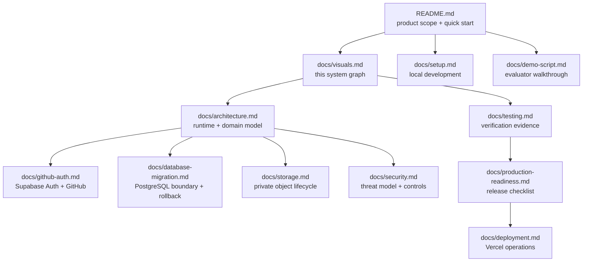
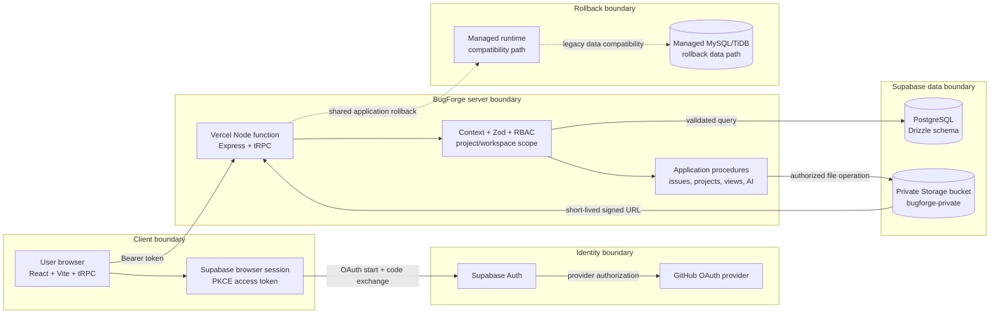
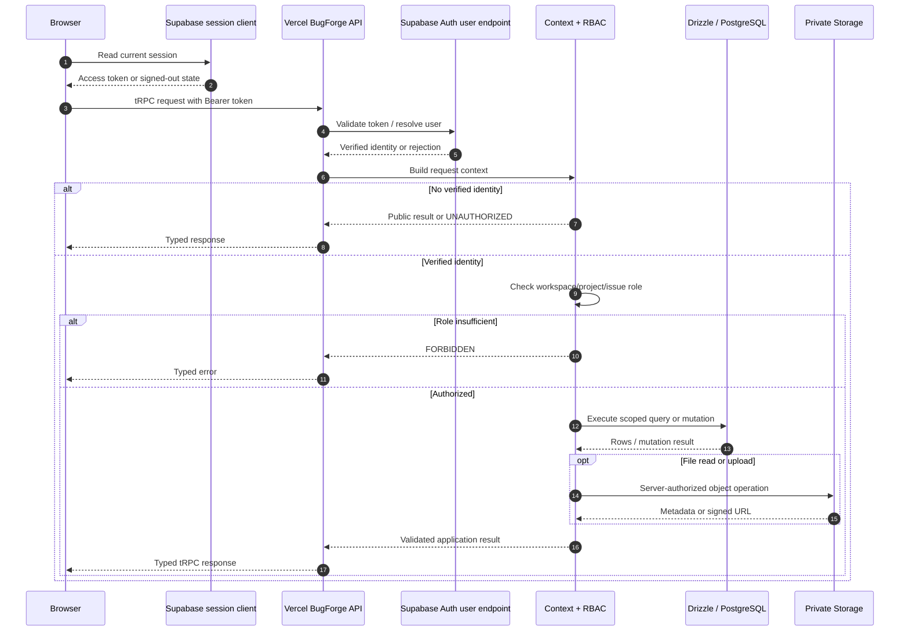
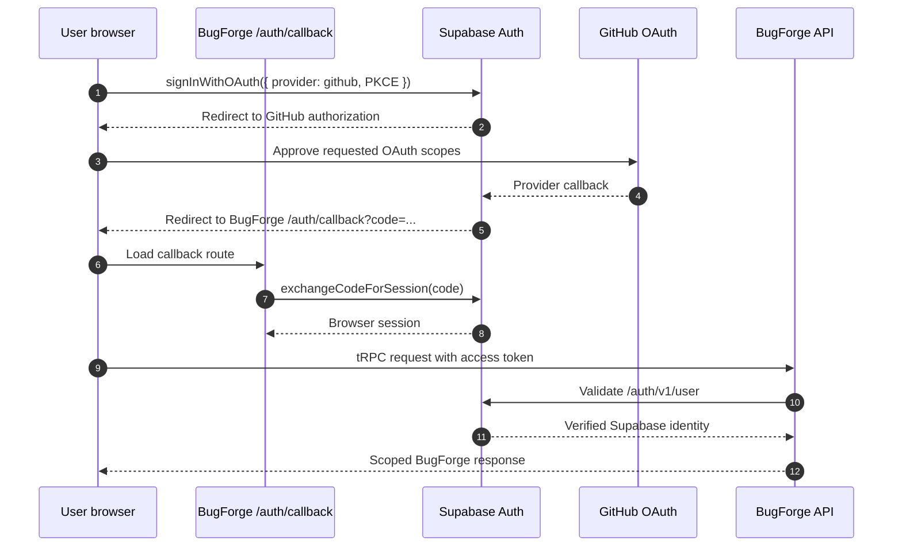
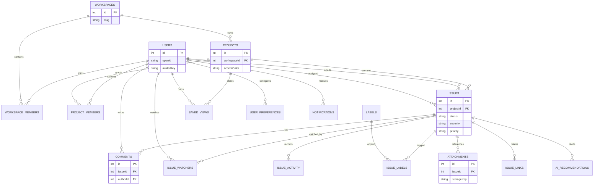
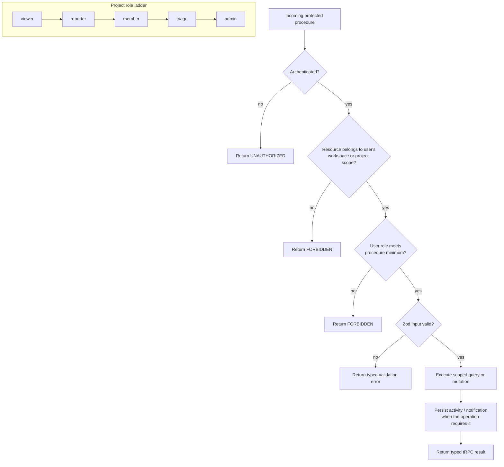
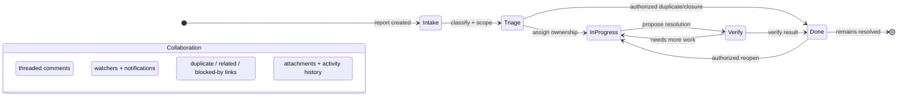
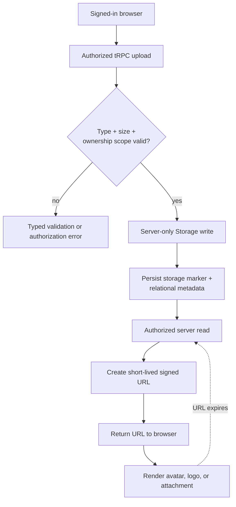
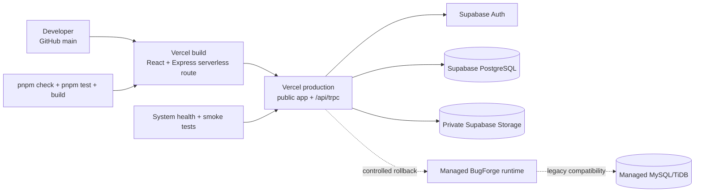
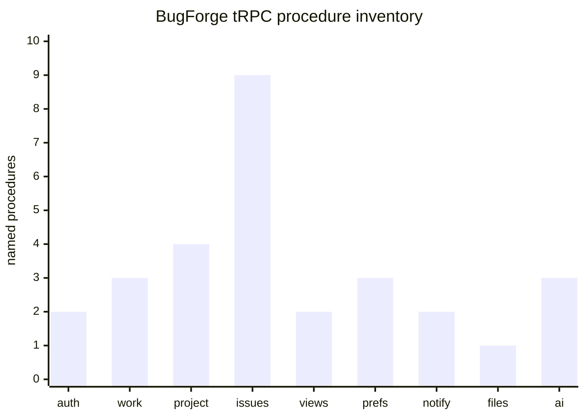

# BugForge system documentation graph

This page is the visual companion to the BugForge engineering documentation. It explains **what exists, where it runs, which boundary owns each decision, and how the major workflows move through the system**. Every diagram is written in Mermaid so GitHub can render and review it as source-controlled documentation.[1]

> **Reading rule:** solid arrows represent an active runtime or data path; dashed arrows represent a fallback, compatibility, or operational relationship. A diagram documents intended responsibility boundaries; it does not claim that an external provider has access to secrets or plaintext it does not receive.

## 1. Documentation map

The repository documentation is organized as a path from product intent to implementation evidence. Start with the root README, use the architecture and visual pages to understand the system, then open the focused operational guides for setup, authentication, data, storage, security, testing, and deployment.

| Reader question | Primary document | Evidence anchor |
| --- | --- | --- |
| What problem does BugForge solve? | [`README.md`](../README.md) | Product scope and feature map |
| How is the product deployed? | [`architecture.md`](architecture.md), [`deployment.md`](deployment.md) | Vercel, Supabase, and managed rollback boundaries |
| How does sign-in work? | [`github-auth.md`](github-auth.md) | `client/src/lib/supabase.ts`, `server/_core/supabaseAuth.ts` |
| How are files protected? | [`storage.md`](storage.md) | `server/storage.ts`, `server/routers.ts` |
| How do issue permissions work? | [`security.md`](security.md), [`architecture.md`](architecture.md) | `server/_core/trpc.ts`, `server/routers.ts` |
| How was the implementation verified? | [`testing.md`](testing.md) | `server/*.test.ts`, `client/src/**/*.test.ts` |

## 2. System context and trust boundaries

This is the highest-level boundary map. The browser owns presentation and the Supabase Auth client session. The server owns authorization, validation, database access, Storage writes, and the decision to return a short-lived signed URL. GitHub is an OAuth identity provider, not the BugForge database or file store. Supabase is split into Auth, PostgreSQL, and private Storage responsibilities.[2] [3]

### Boundary legend

| Boundary | Owns | Does not own |
| --- | --- | --- |
| Browser | Rendering, interaction, local Supabase session handling, tRPC calls | Database authorization, service-role credentials, direct private Storage access |
| Supabase Auth / GitHub | Identity proof and OAuth provider consent | BugForge issue permissions or project membership |
| BugForge API | Input validation, project scope, role checks, business mutations, response shaping | Browser rendering or identity-provider account administration |
| Supabase PostgreSQL | Durable relational state and metadata | Raw file bytes or OAuth provider sessions |
| Private Storage | Avatar, project-logo, and attachment bytes | Issue authorization decisions; those remain server-side |
| Managed rollback path | Compatibility and recovery option for the former runtime | The active external Supabase deployment path |

## 3. Request lifecycle: browser to scoped data

The request path shows where an unauthenticated request stops and where a valid request becomes project-scoped application data. The server context resolves the identity first; each protected procedure then applies the minimum workspace, project, or issue role required by the operation.[4] [5]

**Implementation trace:** request context and procedure guards live in [`server/_core/context.ts`](../server/_core/context.ts), [`server/_core/trpc.ts`](../server/_core/trpc.ts), and [`server/routers.ts`](../server/routers.ts). The database connection boundary is implemented in [`server/db.ts`](../server/db.ts), while the Supabase identity adapter is in [`server/_core/supabaseAuth.ts`](../server/_core/supabaseAuth.ts).

## 4. Authentication: GitHub through Supabase Auth

BugForge preserves the GitHub login flow through Supabase Auth. GitHub returns authorization to Supabase; the browser exchanges the one-time PKCE code for a session; the API validates the resulting bearer token before it exposes protected workspace data. The callback page is a browser route, not a second OAuth provider.[2] [6]

| Stage | Source of truth | Repository implementation |
| --- | --- | --- |
| OAuth initiation | Supabase browser client | [`client/src/lib/supabase.ts`](../client/src/lib/supabase.ts) and [`client/src/_core/hooks/useAuth.ts`](../client/src/_core/hooks/useAuth.ts) |
| One-time code exchange | Supabase Auth PKCE | [`client/src/pages/AuthCallback.tsx`](../client/src/pages/AuthCallback.tsx) |
| Server identity validation | Supabase Auth user endpoint | [`server/_core/supabaseAuth.ts`](../server/_core/supabaseAuth.ts) |
| Protected procedure context | BugForge server | [`server/_core/context.ts`](../server/_core/context.ts) |
| Regression evidence | Vitest | [`server/supabaseAuth.avatar.test.ts`](../server/supabaseAuth.avatar.test.ts), [`server/auth.logout.test.ts`](../server/auth.logout.test.ts) |

## 5. Relational domain model

The ER diagram focuses on the relationships needed to understand authorization and issue collaboration. The complete typed schema remains in [`drizzle/schema.ts`](../drizzle/schema.ts); the graph intentionally omits individual columns that do not change the system boundary.

### Why the relationship model matters

Workspace membership establishes the outer organizational boundary. Project membership establishes the normal issue boundary. Issue-linked records inherit authorization from the issue’s project, while user preferences and notifications remain user-owned. This separation is what allows BugForge to support collaboration without treating every authenticated user as a global administrator.

## 6. Authorization decision graph

The role ladder is deliberately explicit. A request must satisfy identity, workspace/project scope, and the minimum role required by the procedure. Admin-only mutations, such as project deletion or accent updates, do not become available merely because a user can view an issue.

| Control | Code anchor | Verification anchor |
| --- | --- | --- |
| Protected procedure wrapper | [`server/_core/trpc.ts`](../server/_core/trpc.ts) | [`server/routers.authorization.test.ts`](../server/routers.authorization.test.ts) |
| Project-scope checks | [`server/routers.ts`](../server/routers.ts) | [`server/routers.project-scope.test.ts`](../server/routers.project-scope.test.ts) |
| Workspace deletion guard | [`server/db.ts`](../server/db.ts) | [`server/db.workspace-delete.test.ts`](../server/db.workspace-delete.test.ts) |
| Input validation | [`server/routers.ts`](../server/routers.ts) | Router and persistence tests |
| Database permission boundary | [`server/db.ts`](../server/db.ts) | [`server/db.permissions.test.ts`](../server/db.permissions.test.ts) |

## 7. Issue lifecycle and collaboration state

The lifecycle is a controlled workflow rather than an arbitrary status label. Triage and assignment add context, verification provides a quality gate, and authorized reopening preserves the ability to correct an incomplete resolution. Activity history, comments, watchers, links, and attachments surround the lifecycle without bypassing its permissions.

The implemented status vocabulary is `intake`, `triage`, `in_progress`, `verify`, and `done`; resolution vocabulary and issue-link types are defined alongside the schema enums in [`drizzle/schema.ts`](../drizzle/schema.ts). The server treats transitions as project-scoped operations, not client-only visual changes.

## 8. Private file lifecycle

Avatars, project logos, and issue attachments use a private Supabase Storage bucket. The browser submits an authorized tRPC request; the server validates type, size, and ownership scope; the server writes bytes and metadata; and reads return short-lived signed URLs. This follows the private-bucket model in Supabase Storage documentation.[3]

| File class | Authorization scope | Metadata path | Byte path |
| --- | --- | --- | --- |
| User avatar | Authenticated user identity | `users.avatarKey` | Private bucket object |
| Project logo | Project administrator | `projects.logoKey` | Private bucket object |
| Issue attachment | Project member with issue access | `attachments.storageKey` | Private bucket object |

The adapter and signed URL rules live in [`server/storage.ts`](../server/storage.ts); upload procedures live in [`server/routers.ts`](../server/routers.ts). Browser clients do not receive the service-role credential, and legacy managed-storage markers remain readable for rollback compatibility.

## 9. Deployment and rollback topology

The active external deployment is Vercel plus Supabase. The managed runtime remains a rollback path; it is not presented as an active dual-write system. This distinction matters because rollback is safer when it is explicit and reversible rather than hidden behind simultaneous writes.

| Operational concern | Active path | Rollback or evidence path |
| --- | --- | --- |
| Hosting | Vercel production | Managed runtime remains available as documented fallback |
| Identity | Supabase Auth with GitHub | OAuth configuration and callback documentation |
| Relational data | Supabase PostgreSQL via Drizzle/node-postgres | Managed MySQL/TiDB retained as rollback path |
| File data | Private Supabase Storage | Legacy storage markers remain readable where required |
| AI recommendations | Managed Forge adapter | No Vercel AI Gateway funding or credentials required |
| Verification | Health endpoint, build, type check, Vitest | [`docs/testing.md`](testing.md) and [`docs/production-readiness.md`](production-readiness.md) |

## 10. API surface inventory

This chart is a **source-derived inventory**, not a traffic, quality, or performance claim. The counts reflect the named primary router namespaces in [`server/routers.ts`](../server/routers.ts) at the time this documentation was written.

| Namespace | Count | Responsibility | Source |
| --- | ---: | --- | --- |
| `auth` | 2 | Session-facing identity and logout | [`server/routers.ts`](../server/routers.ts) |
| `workspace` | 3 | Workspace discovery, creation, and protected deletion | [`server/routers.ts`](../server/routers.ts) |
| `project` | 4 | Project overview, membership, workflow, and accent settings | [`server/routers.ts`](../server/routers.ts) |
| `issues` | 9 | Search, board, detail, mutation, comments, watches, and links | [`server/routers.ts`](../server/routers.ts) |
| `views` | 2 | Saved searches and filters | [`server/routers.ts`](../server/routers.ts) |
| `personalization` | 3 | Preferences and image uploads | [`server/routers.ts`](../server/routers.ts) |
| `notifications` | 2 | Notification list and read state | [`server/routers.ts`](../server/routers.ts) |
| `attachments` | 1 | Authorized private file upload | [`server/routers.ts`](../server/routers.ts) |
| `ai` | 3 | Analyze, apply, and dismiss human-reviewed drafts | [`server/routers.ts`](../server/routers.ts) |
| **Total** | **29** | **Typed procedures represented in the primary application router** | **Repository source** |

## 11. Traceability matrix

The matrix connects evaluator-visible capabilities to the implementation layer, persistence layer, and verification evidence. It is intentionally more useful than a feature-only checklist: a reviewer can follow each row from behavior to source to test.

| Capability | UI entry point | Server contract | Persistence / integration | Verification |
| --- | --- | --- | --- | --- |
| GitHub login | [`AuthCallback.tsx`](../client/src/pages/AuthCallback.tsx) | `auth.me`, protected context | Supabase Auth | Auth and Supabase tests |
| Project-scoped issue tracking | Issue Explorer, Issue Desk, Boards | `issues.*` procedures | `issues`, `comments`, `issueActivity` | Authorization and project-scope tests |
| Workspace and project RBAC | Workspace and project settings | Workspace/project guards | `workspaceMembers`, `projectMembers` | Permission tests |
| Saved searches and command navigation | [`CommandPalette.tsx`](../client/src/components/CommandPalette.tsx) | `views.*`, personalization procedures | `savedViews`, `userPreferences` | Saved-search integration tests |
| Project accents and ordering | [`ProjectPersonalization.tsx`](../client/src/components/ProjectPersonalization.tsx) | Project update + preference mutations | `projects`, `userPreferences` | Personalization tests |
| Private avatars, logos, attachments | Personalize and issue detail surfaces | Authorized upload/read procedures | Supabase Storage + metadata markers | Storage and upload authorization tests |
| Human-reviewed AI drafts | Issue Desk AI review | `ai.analyze`, `ai.apply`, `ai.dismiss` | `aiRecommendations` | Router and persistence coverage |
| Production readiness | Health endpoint and deployment config | System health route | Vercel + Supabase | Build, type, test, and smoke evidence |

## 12. Diagram maintenance rules

When implementation changes, update the diagram and its traceability row in the same pull request. Keep labels aligned with the enums and router namespaces in the source tree. Do not turn a fallback arrow into an active data path unless the deployment and rollback documentation are updated together. Do not use generated artwork for these graphs: the relationships, role boundaries, and counts must remain reviewable as source-controlled structure.

## References

[1]: https://mermaid.js.org/intro/ "Mermaid documentation"
[2]: https://supabase.com/docs/guides/auth/social-login/auth-github "Supabase Auth GitHub provider"
[3]: https://supabase.com/docs/guides/storage "Supabase Storage documentation"
[4]: https://trpc.io/docs/server/procedures "tRPC server procedures"
[5]: https://zod.dev/ "Zod schema validation"
[6]: https://supabase.com/docs/guides/auth/sessions/pkce-flow "Supabase Auth PKCE flow"
