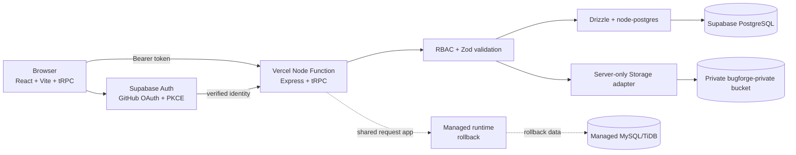
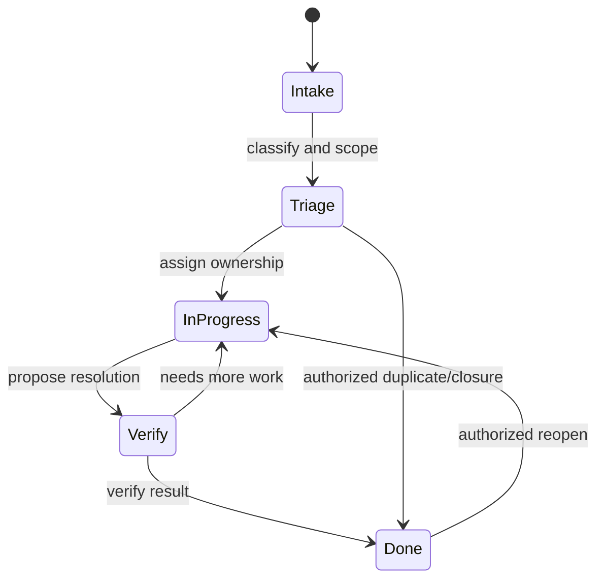
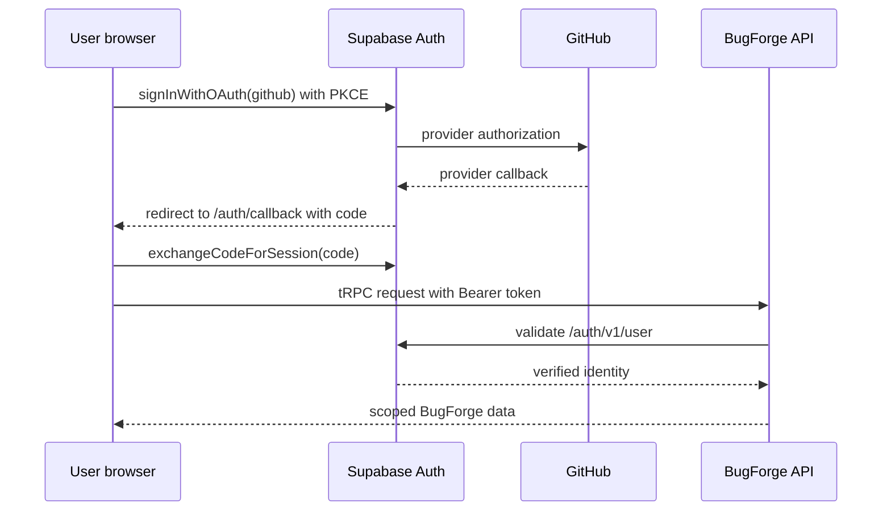
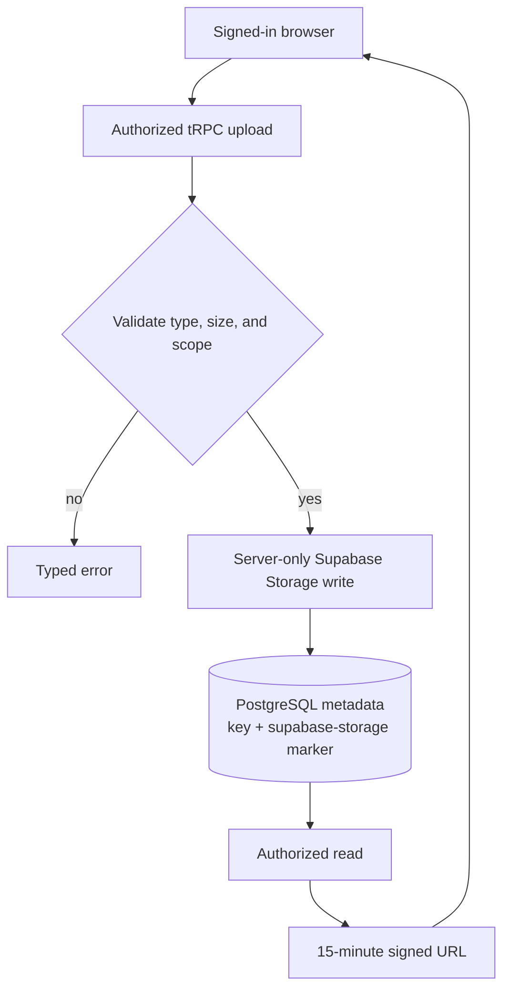

# BugForge visual documentation

These diagrams and charts are maintained as documentation artifacts. They describe the implemented boundaries rather than presenting a marketing illustration. The procedure chart is an inventory of the current router namespaces in `server/routers.ts`; it is not a usage or performance metric.

## Runtime architecture

## Issue lifecycle

Each transition is project-scoped, permission-checked on the server, and recorded in activity history. The visual lane names are **Intake**, **Triage**, **In progress**, **Verify**, and **Done**.

## Authentication sequence

The GitHub OAuth App callback is the Supabase Auth callback. The Vercel `/auth/callback` page is the post-auth browser route and exchanges the one-time PKCE code.

## Private Storage flow

No browser Storage policy or service-role credential is required. Legacy managed-storage paths remain readable for compatibility with existing rollback data.

## Current tRPC procedure inventory

The following counts are derived from the named procedures in `server/routers.ts` and help readers understand the application surface. They are not claims about traffic volume or feature quality.

| Namespace | Procedure count | Primary responsibility |
| --- | ---: | --- |
| `auth` | 2 | Session-facing identity and logout. |
| `workspace` | 3 | Workspace discovery, creation, and protected deletion. |

| `project` | 4 | Overview, membership, workflow, and accent settings. |
| `issues` | 9 | Search, board, detail, mutation, comments, watches, and links. |
| `views` | 2 | Saved searches and filters. |
| `personalization` | 3 | Preferences and image uploads. |
| `notifications` | 2 | Notification list and read state. |
| `attachments` | 1 | Authorized private file upload. |
| `ai` | 3 | Analyze, apply, and dismiss human-reviewed drafts. |
| **Total** | **29** | **Typed application procedures inventoried in the primary router.** |

## References

[1]: https://mermaid.js.org/intro/ "Mermaid documentation"
[2]: https://supabase.com/docs/guides/auth/social-login/auth-github "Supabase Auth GitHub provider"
[3]: https://supabase.com/docs/guides/storage "Supabase Storage documentation"
